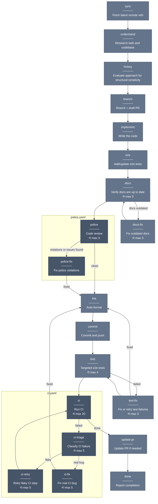

# Workflow DAG

MCP-driven YAML graphs that drive coding agents through a task. The workflow server (`padi/`) serves one step at a time as a state machine — Claude calls `workflow_complete(evidence)` to advance.

## How it works

Two parts:

1. **YAML graph** (`.claude/padi/*.yaml`) — nodes, transitions, loop limits
2. **MCP server** (`padi/`) — reads the graph, enforces step ordering, gates advancement on evidence

All nodes are `prompt` type — the server decides what runs, Claude executes the instruction.

### Transitions

Each node has an `on:` map of `condition → next-node`. Conditions are natural language — Claude evaluates them against what happened. `default` is the else branch.

```yaml
police:
  prompt: |
    Run code-police: review for quality, fact-check for correctness,
    and evaluate for elegance.
  max_visits: 3
  on:
    "violations or issues found": police-fix
    default: test
```

### Loop protection

Each node has `max_visits` (default: 1). The server halts if exceeded.

### Entry points

Start mid-graph with `--from`:

```
/padi do --from polish        # just the police→fix loop
/padi do --from ci-only       # just CI
/padi do --from post-implement # skip research, start at fmt
```

## `do.yaml` — full execution workflow



### Loop limits

| Node                                | max_visits | Purpose                     |
| ----------------------------------- | ---------- | --------------------------- |
| `police`                            | 3          | Quality convergence         |
| `test`                              | 4          | Covers flaky retries        |
| `test-fix`                          | 3          | Fix attempts                |
| `ci`                                | 20         | CI can be slow to stabilize |
| `ci-triage` / `ci-retry` / `ci-fix` | 5          | Per-failure handling        |
