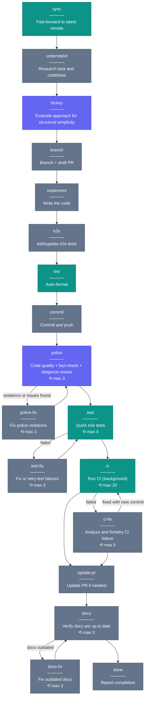

# Workflow DAG

Declarative YAML graphs that drive coding agents through a task. The orchestrator command (`/workflow`) reads a graph and follows it node-by-node — no external agent harness, stays entirely within Claude Code CLI.

## How it works

Three parts:

1. **YAML graph** (`.claude/workflows/*.yaml`) — nodes, transitions, loop limits
2. **Orchestrator** (`.claude/commands/workflow.md`) — reads the graph, drives execution
3. **Claude** — executes nodes, evaluates transitions, tracks visit counts

### Node types

| Type     | What it does                       | Example                         |
| -------- | ---------------------------------- | ------------------------------- |
| `skill`  | Invokes a skill via Skill tool     | `hickey`, `code-police`         |
| `run`    | Executes a shell command via Bash  | `just ci`, `just fmt`           |
| `prompt` | Claude follows inline instructions | "Implement the planned changes" |

### Transitions

Each node has an `on:` map of `condition → next-node`. Conditions are natural language — Claude evaluates them against conversation context. `default` is the else branch.

```yaml
police:
  skill: code-police
  max_visits: 3
  on:
    "violations or issues found": police-fix
    default: test
```

### Loop protection

Each node has `max_visits` (default: 1). The orchestrator halts if exceeded.

### Entry points

Start mid-graph with `--from`:

```
/workflow do --from polish    # just the police→fix loop
/workflow do --from ci-only   # just CI
/workflow do --from post-implement  # skip research, start at fmt
```

## `do.yaml` — full execution workflow

The default workflow replaces srid-do's 11 hardcoded steps.



**Legend:** 🟣 skill nodes — 🟢 run nodes — ⚫ prompt nodes — 🟡 fix loops

### Loop limits

| Node                    | max_visits | Purpose                     |
| ----------------------- | ---------- | --------------------------- |
| `police` / `police-fix` | 3          | Quality convergence         |
| `test`                  | 4          | Covers flaky retries        |
| `test-fix`              | 3          | Real fix attempts           |
| `ci` / `ci-fix`         | 5          | CI can be slow to stabilize |

## Writing your own workflow

Create a YAML file in `.claude/workflows/` following this schema:

```yaml
version: 1

defaults:
  max_visits: 1 # default loop limit per node

entry_points:
  default: first-node # where /workflow starts
  fast: some-node # named entry: /workflow name --from fast

nodes:
  first-node:
    run: "some command" # or: skill: skill-name / prompt: |
    description: What this does # printed before execution
    max_visits: 3 # override default (for loop nodes)
    on:
      "condition text": next-node
      default: fallback-node
```

Nodes with no `on:` map are terminal — the workflow ends there.
