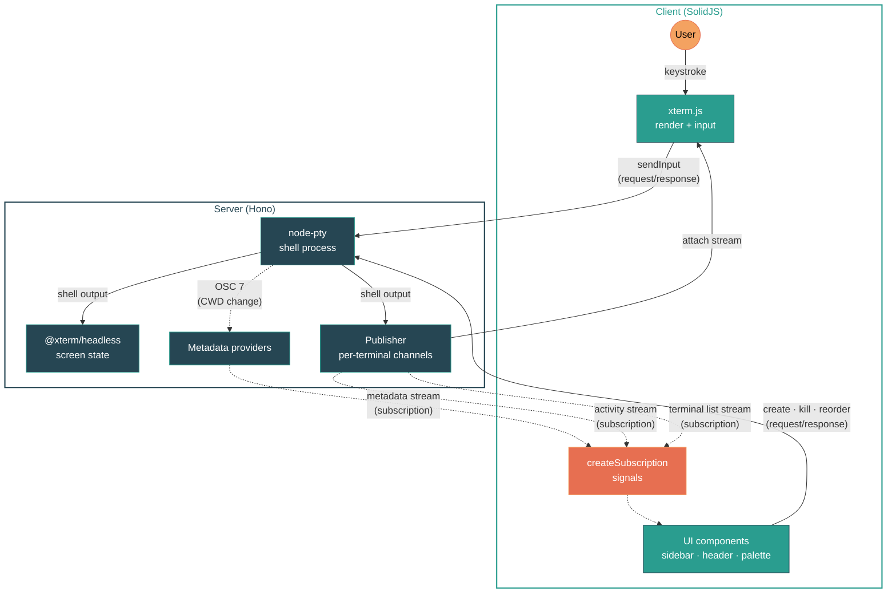

<p align="center">
  
</p>

# kolu

A browser cockpit for coding agents. Bring your own CLI, run them anywhere.

Unlike agent command centers that wrap a single model behind their own chat UI, kolu stays out of the agent's way: the terminal is the universal interface, so `claude`, `opencode`, `aider`, or whatever ships next week works out of the box — and you can drop to a plain shell whenever you want. It's an [Agentic Development Environment](https://x.com/jdegoes/status/2036931874057314390) (ADE) that treats terminals as the thesis, not the substrate.

## Philosophy

Two principles shape what kolu is and isn't:

**Agent-agnostic.** The terminal is the universal interface. Kolu doesn't wrap a specific model or lock you into one CLI — `claude`, `opencode`, `aider`, or whatever ships next week all work the same way, because they're just programs you run in a shell. There's no agent registry to update, no adapter to write, no vendor lock-in. Any new agent CLI picks up first-class features automatically: run it once in any kolu terminal and the next time you create a worktree, it appears in the sub-palette as a launch option — no configuration, no per-agent code. You can always drop to a plain shell without leaving the app.

**Auto-detected, zero setup.** Kolu populates its UI by watching what you already do — the repos you `cd` into, the agents you run, the sessions you save — not by asking you to configure it. Recent repos track `cd` events, branch / PR / CI status derive from the terminal's CWD, Claude Code state is read from the foreground pid, recent agent CLIs come from preexec command marks emitted by kolu's shell integration, and activity sparklines come from pty output. If kolu knows something, it's because the shell already told it. The surface grows with your workflow, not with a preferences pane.

## Usage

```sh
nix run github:juspay/kolu       # serve on 127.0.0.1:7681
nix run github:juspay/kolu -- --host 0.0.0.0 --port 8080  # expose on LAN
```

## Features

### Terminals

- Create, switch, kill, and drag-to-reorder terminals from a collapsible sidebar
- Split terminals — <kbd>Ctrl+&#96;</kbd> splits a bottom pane per terminal; <kbd>Ctrl+Shift+&#96;</kbd> adds tabs, <kbd>Ctrl+PageDown</kbd> / <kbd>Ctrl+PageUp</kbd> cycles
- Font zoom (<kbd>Cmd/Ctrl</kbd> <kbd>+</kbd>/<kbd>-</kbd>), persisted per terminal across sessions
- WebGL rendering with canvas fallback, clickable URLs, Unicode 11, inline images (sixel, iTerm2, kitty)
- Lazy attach — late-joining clients receive serialized screen state (~4KB) instead of replaying raw buffer
- Mobile key bar — on coarse-pointer devices, a thin row above the terminal sends the keys soft keyboards lack (<kbd>Esc</kbd>, <kbd>Tab</kbd>, arrows, <kbd>Ctrl+C</kbd>) plus an IME-bypassing <kbd>Enter</kbd> for Android chat keyboards, with a haptic tick on every tap. Touch-swipe inside the terminal scrolls the scrollback buffer

### Navigation

- Command palette (<kbd>Cmd/Ctrl+K</kbd>) — search terminals, switch themes, run actions
- Agent-aware command palette — once you've run a known agent CLI (`claude`, `aider`, `opencode`, `codex`, `goose`, `gemini`, `cursor-agent`) in any kolu terminal, it surfaces in two places: under `New terminal → <recent repo>` as a sub-palette that creates the worktree and launches the agent in one step, and under `Debug → Recent agents` as a prefill-into-active-terminal affordance. Prompt/message flag values (`-p`/`--prompt`/`-m`/`--message`) are stripped before storage so ephemeral prompt text never lands in the persisted MRU
- Sidebar agent previews — when an agent is waiting on you (or has finished with an unread completion), its sidebar card expands with a live xterm preview so you can peek without switching. Toggle in Settings. <kbd>Ctrl+Tab</kbd> (or <kbd>Alt+Tab</kbd>) cycles terminals in MRU order: hold the modifier, press Tab to advance, release to commit
- Keyboard-driven — <kbd>Cmd+T</kbd> new terminal, <kbd>Cmd+1</kbd>…<kbd>Cmd+9</kbd> jump, <kbd>Cmd+Shift+[</kbd> / <kbd>Cmd+Shift+]</kbd> cycle, <kbd>Cmd+/</kbd> shortcuts help

### Canvas mode

An alternative to the default single-terminal focus layout — all terminals float as draggable, resizable windows on an infinite 2D canvas. Toggle via the grid icon in the header.

- **Infinite pan & zoom** — two-finger scroll / trackpad to pan, pinch or <kbd>Ctrl+scroll</kbd> to zoom. No boundaries — the canvas extends freely in every direction via CSS `transform: translate() scale()` (Figma/Excalidraw model)
- **Snap-to-grid** — tiles snap to a 24px grid on drag and resize for tidy layouts
- **Keyboard navigation** — <kbd>Cmd/Ctrl+Shift+1</kbd> fits all tiles in the viewport, <kbd>Cmd/Ctrl+Shift+2</kbd> centers on the active tile
- **Per-tile theming** — title bars derive their colors from each terminal's theme for guaranteed contrast
- **Desktop-only** — mobile devices always use focus mode; canvas mode preference is persisted server-side

### Git & GitHub

- Auto-detected repo name, branch, and working directory (via OSC 7 + `.git/HEAD` watcher)
- GitHub PR detection — shows PR number, title, and CI check status (pass/pending/fail) in header and sidebar
- Per-repo color coding in sidebar via golden-angle hue spacing
- Activity sparklines per terminal (5-minute rolling window)

### Claude Code Status

Detects [Claude Code](https://docs.anthropic.com/en/docs/claude-code) sessions running in any terminal and shows their state in the header and sidebar.

**What we detect:**

| State    | Indicator          | Meaning                                              |
| -------- | ------------------ | ---------------------------------------------------- |
| Thinking | Pulsing accent dot | API call in flight — Claude is generating a response |
| Tool use | Pulsing yellow dot | Claude is executing tools or waiting for permission  |
| Waiting  | Dim dot            | Claude finished responding, waiting for user input   |

**How it works:** asks each terminal for its current foreground process pid via `tcgetpgrp(fd)` (exposed by node-pty's `foregroundPid` accessor), then checks whether `~/.claude/sessions/<fgpid>.json` exists. If it does, that terminal is running claude-code — we tail the session's JSONL transcript to derive state from the last message. Cross-platform (Linux + macOS) since `tcgetpgrp` is POSIX. Each card also surfaces the session's display title (custom title › auto-generated summary › first prompt) via the [Claude Agent SDK](https://platform.claude.com/docs/en/api/agent-sdk/typescript)'s `getSessionInfo()`, refreshed best-effort on each transcript change.

**What we can't detect:**

- **Permission prompts vs tool execution** — both show as "tool use" since the JSONL doesn't distinguish them
- **Streaming progress** — intermediate thinking tokens aren't tracked, only final state transitions
- **Wrapped invocations** — if claude-code is launched via a wrapper (e.g. `script -q out.log claude`), the foreground pid is the wrapper, not claude itself, so the session lookup misses
- **Sub-agents** — nested agent spawns appear as tool use, not as separate tracked sessions

**Debugging detection:** the command palette has a `Debug → Show Claude transcript` entry (visible only when the active terminal has a Claude session) that opens a side-by-side view of the server's state-change log next to the raw JSONL events from disk since monitoring began. Use it when state seems stuck or transitions feel missed.

### OpenCode Status

Detects [OpenCode](https://github.com/anomalyco/opencode) sessions and shows their state alongside Claude Code in the sidebar and header.

**How it works:** when the foreground process is `opencode`, the provider queries OpenCode's SQLite database directly at `~/.local/share/opencode/opencode.db` to find the most recently updated session whose `directory` matches the terminal's CWD. State is derived from the latest message: a user message means the assistant is _thinking_; an assistant message with `time.completed` set and `finish: "stop"` means _waiting_; otherwise still _thinking_. Todo progress comes from a `COUNT(*)` over the `todo` table — much simpler than Claude Code's tool-call parsing since OpenCode stores todos as first-class rows with a `status` column. Live updates come from `fs.watch` on the SQLite WAL file (`opencode.db-wal`), which OpenCode writes to on every database mutation.

**Why SQLite, not REST?** The OpenCode TUI doesn't expose an HTTP server by default — that's a separate `opencode serve` mode. Reading the SQLite DB directly works against the actual TUI users run, with no port discovery and no extra processes. SQLite WAL mode allows concurrent readers while OpenCode is writing, so we can open the DB read-only without blocking it.

**What we detect:**

| State    | Indicator          | How                                                                     |
| -------- | ------------------ | ----------------------------------------------------------------------- |
| Thinking | Pulsing accent dot | Latest assistant message has no `time.completed`                        |
| Tool use | Spinning yellow    | Thinking + any `part` with `type: "tool"` and `state.status: "running"` |
| Waiting  | Dim dot            | Latest assistant message has `time.completed` set and `finish: "stop"`  |

**What we can't detect (yet):**

- **Same-directory disambiguation** — if multiple OpenCode sessions share a working directory, we pick the most recently updated one
- **Non-default DB location** — set `KOLU_OPENCODE_DB` to override the path

### Theming

- 200+ color schemes from [iTerm2-Color-Schemes](https://github.com/mbadolato/iTerm2-Color-Schemes), switchable at runtime
- Live preview while browsing themes in the palette
- Shuffle theme — new terminals (and the active one on <kbd>⌘J</kbd>) get a background perceptually distinct from every other open terminal (toggleable; on by default)
- Dark / light / system UI theme

### Clipboard

- <kbd>Ctrl+V</kbd> pastes images into Claude Code via server-side clipboard shims

## Architecture

pnpm monorepo:

| Package                              | Stack                                                                                                                                            |
| ------------------------------------ | ------------------------------------------------------------------------------------------------------------------------------------------------ |
| `packages/common/`                   | [oRPC](https://orpc.dev/) contract + [Zod](https://zod.dev/) schemas                                                                             |
| `packages/server/`                   | [Hono](https://hono.dev/) + [node-pty](https://github.com/microsoft/node-pty) + [@xterm/headless](https://www.npmjs.com/package/@xterm/headless) |
| `packages/client/`                   | [SolidJS](https://www.solidjs.com/) + [xterm.js](https://xtermjs.org/) + [Tailwind CSS v4](https://tailwindcss.com/)                             |
| `packages/integrations/claude-code/` | Claude Code detection — JSONL transcript tailing + Claude Agent SDK                                                                              |
| `packages/integrations/anyagent/`    | Agent-agnostic shared types and utilities (Logger, TaskProgress, agent CLI parsing)                                                              |
| `packages/integrations/opencode/`    | OpenCode detection — reads OpenCode's SQLite database via Node's built-in `node:sqlite`                                                          |
| `packages/terminal-themes/`          | Terminal color scheme catalog + perceptual-distance picker — themes checked-in as JSON                                                           |
| `packages/memorable-names/`          | ADJ-NOUN random name generator — word lists checked-in as JSON                                                                                   |

### Communication

All traffic flows over a single WebSocket (`/rpc/ws`) via [oRPC](https://orpc.dev/). The contract in `packages/common/` is shared by both sides — types checked at compile time, payloads validated by Zod at runtime. Two communication patterns:

| Pattern            | Semantics                                  | Client integration                    | Used for                                                   |
| ------------------ | ------------------------------------------ | ------------------------------------- | ---------------------------------------------------------- |
| Request / response | one-shot RPC call                          | plain `client.*` calls                | `terminal.create`, `terminal.kill`, `terminal.reorder`     |
| Subscription       | server pushes values over WebSocket stream | `createSubscription` → SolidJS signal | Terminal list, metadata, activity sparklines, server state |

Subscriptions use [`createSubscription`](packages/client/src/rpc/createSubscription.ts) — a 150-line primitive that converts an `AsyncIterable` into a SolidJS signal via `createStore` + `reconcile` for fine-grained reactivity. Per-terminal subscriptions use SolidJS's `mapArray` for automatic lifecycle management.

### Data flow

Two loops drive the system — a **terminal I/O loop** (the hot path) and a **metadata loop** (side-channel enrichment). Both flow over the same WebSocket and land in SolidJS signals on the client via `createSubscription`.



**Terminal I/O** (solid lines) — keystrokes go through `sendInput` RPC to node-pty; shell output flows back through the [publisher](packages/server/src/publisher.ts) as an `attach` stream to xterm.js. An @xterm/headless instance parses VT sequences server-side for screen-state snapshots[^lazy-attach].

**Metadata** (dashed lines) — shell activity triggers a provider DAG: CWD changes (OSC 7) → git provider (.git/HEAD watcher) → GitHub provider (`gh pr view` polling). Agent providers detect coding agents: the Claude provider wakes on title events (OSC 2) and `fs.watch` on `~/.claude/sessions/` to check each terminal's pty foreground pid; the OpenCode provider queries OpenCode's SQLite database directly (`~/.local/share/opencode/opencode.db`) and watches its WAL file for live state updates. All providers feed a single metadata channel streamed to the client as a subscription[^providers]. Separately, kolu's preexec hook emits an `OSC 633;E` command mark before each user command; the pty handler parses it, matches the first token against a known-agents allowlist, and pushes normalized invocations to a bounded recent-agents MRU published via the server-state stream — powering the agent-aware command palette entries without any `/proc` lookups or argv scraping.

**User actions** — command palette and sidebar dispatch plain oRPC client calls ([`useTerminalCrud`](packages/client/src/terminal/useTerminalCrud.ts), [`useWorktreeOps`](packages/client/src/terminal/useWorktreeOps.ts)). The server's live subscriptions push updated state to the client automatically. [`useTerminalMetadata`](packages/client/src/terminal/useTerminalMetadata.ts) uses SolidJS's `mapArray` to create per-terminal subscriptions that automatically tear down when terminals are removed[^client-state].

[^lazy-attach]: ~4 KB serialized snapshot instead of replaying the full scrollback buffer.

[^providers]: Git provider uses [simple-git](https://github.com/steveukx/git-js); GitHub provider derives combined CI status from `CheckRun` + `StatusContext`; Claude provider asks the pty for `tcgetpgrp(fd)` and stats `~/.claude/sessions/<fgpid>.json` directly — re-checked on each title event and `fs.watch` notification, then tails the session's JSONL transcript via another `fs.watch` for state updates. The session display title comes from a fire-and-forget [`getSessionInfo()`](https://platform.claude.com/docs/en/api/agent-sdk/typescript) call piggybacking on the same transcript watcher. OpenCode provider activates when `opencode` is the foreground process, queries `~/.local/share/opencode/opencode.db` (SQLite) for sessions matching the terminal's CWD, and watches the WAL file (`opencode.db-wal`) for live state updates via Node's built-in `node:sqlite` module.

[^client-state]: Local-only view state (active terminal, MRU order, attention flags) lives in SolidJS [signals and stores](https://docs.solidjs.com/reference/store-utilities/create-store) inside singleton `useXxx.ts` modules — separate from server-derived subscription state.

**Persistence** — sessions auto-save to `~/.config/kolu/state.json` via [`conf`](https://github.com/sindresorhus/conf), debounced at 500 ms[^persistence].

[^persistence]: Schema is versioned with explicit migrations. Stores CWD, sort order, and parent relationships per terminal.

[PartySocket](https://docs.partykit.io/reference/partysocket-api/) handles WebSocket auto-reconnect; the `stream` namespace in `packages/client/src/rpc/rpc.ts` routes every async-iterator procedure through oRPC's [`ClientRetryPlugin`](https://orpc.dev/docs/plugins/client-retry) so consumers transparently re-subscribe after a drop — every server-side streaming handler is already snapshot-then-deltas and the reducer in `useTerminalMetadata.ts` pattern-matches an `ActivityStreamEvent` discriminated union (`snapshot` replaces, `delta` appends) so re-subscribe resume is structural, not defensive. Transport events (`connecting` / `connected` / `disconnected` / `reconnected` / `restarted`) are exposed as a single `ServerLifecycleEvent` signal, and `TransportOverlay` pattern-matches it into one dim-backdrop card: `disconnected` shows "Reconnecting…" (the backdrop is pointer-events-none, so users can still scroll and read buffers underneath), and `restarted` swaps to "Server updated" with the Reload button inline in the card.

### Build & packaging

Packaged with [Nix](https://nixos.asia/en/install). The flake has **zero inputs** — nixpkgs and other sources are pinned via [npins](https://github.com/andir/npins) and imported with `fetchTarball` to keep `nix develop` fast (~2.6 s cold). Shared env vars are defined once in `koluEnv` and consumed by both the build and the devShell[^build].

[^build]: `koluEnv` includes font paths and clipboard shims. Terminal themes and word lists ship checked-in as JSON (see `packages/terminal-themes/` and `packages/memorable-names/`). The final derivation is a wrapper script that sets the environment and execs [`tsx`](https://tsx.is/).

## Development

Requires [Nix](https://nixos.asia/en/install) with flakes enabled.

```sh
nix develop     # enter devshell
just dev        # run server + client with hot reload
just test       # e2e tests (full nix build)
```

## CI

`just ci` builds all flake outputs on x86_64-linux and aarch64-darwin in parallel, runs e2e tests, and posts GitHub commit statuses. See [`ci/`](ci/) for details and reuse instructions.

```sh
just ci              # full CI run
just ci::protect     # set branch protection
just ci::_summary    # check current status
```

## Deployment (NixOS + home-manager)

A home-manager module runs kolu as a systemd user service:

```nix
{
  imports = [ kolu.homeManagerModules.default ];
  services.kolu = {
    enable = true;
    package = kolu.packages.${system}.default;
    host = "127.0.0.1"; # default
    port = 7681;         # default
  };
}
```

See [`nix/home/example/`](nix/home/example/) for a full configuration with a VM test.

### Diagnosing memory leaks

If kolu grows unbounded (V8 heap climbing over hours), set `services.kolu.diagnostics.dir` to an absolute path. Each restart gets its own timestamped subdir there, with a baseline heap snapshot at T+5min, periodic `"diag"` stats lines (memory bands + `terminals`/`publisherSize`/`claudeSessions`/`pendingSummaryFetches`), and automatic near-OOM snapshots via V8's `--heapsnapshot-near-heap-limit`. `kill -USR2 <pid>` captures an on-demand snapshot into the same dir. Diff two snapshots offline with [memlab](https://facebook.github.io/memlab/docs/cli/CLI-commands/) to name the retainer. Unset = zero overhead; the code path is fully gated.

---

Named after [கோலு](<https://en.wikipedia.org/wiki/Golu_(festival)>), the tradition of arranging figures on tiered steps.
