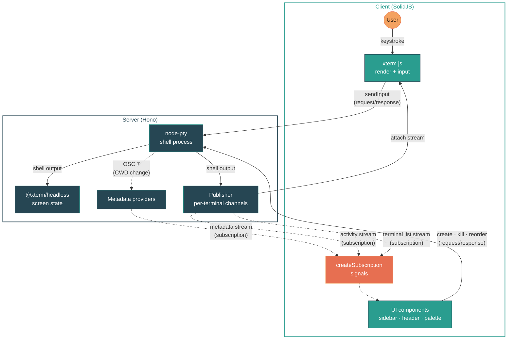

<p align="center">
  
</p>

# kolu

A browser cockpit for coding agents. Bring your own CLI, run them anywhere.

Unlike agent command centers that wrap a single model behind their own chat UI, kolu stays out of the agent's way: the terminal is the universal interface, so `claude`, `opencode`, `aider`, or whatever ships next week works out of the box — and you can drop to a plain shell whenever you want. It's an [Agentic Development Environment](https://x.com/jdegoes/status/2036931874057314390) (ADE) that treats terminals as the thesis, not the substrate.

## Usage

```sh
nix run github:juspay/kolu       # serve on 127.0.0.1:7681
nix run github:juspay/kolu -- --host 0.0.0.0 --port 8080  # expose on LAN
```

## Features

### Terminals

- Create, switch, kill, and drag-to-reorder terminals from a collapsible sidebar
- Split terminals — <kbd>Ctrl+&#96;</kbd> splits a bottom pane per terminal; <kbd>Ctrl+Shift+&#96;</kbd> adds tabs, <kbd>Ctrl+PageDown</kbd> / <kbd>Ctrl+PageUp</kbd> cycles
- Font zoom (<kbd>Cmd/Ctrl</kbd> <kbd>+</kbd>/<kbd>-</kbd>), persisted per terminal across sessions
- WebGL rendering with canvas fallback, clickable URLs, Unicode 11, inline images (sixel, iTerm2, kitty)
- Lazy attach — late-joining clients receive serialized screen state (~4KB) instead of replaying raw buffer

### Navigation

- Command palette (<kbd>Cmd/Ctrl+K</kbd>) — search terminals, switch themes, run actions
- Sidebar agent previews — when an agent is waiting on you (or has finished with an unread completion), its sidebar card expands with a live xterm preview so you can peek without switching. Toggle in Settings. <kbd>Ctrl+Tab</kbd> (or <kbd>Alt+Tab</kbd>) cycles terminals in MRU order: hold the modifier, press Tab to advance, release to commit
- Keyboard-driven — <kbd>Cmd+T</kbd> new terminal, <kbd>Cmd+1</kbd>…<kbd>Cmd+9</kbd> jump, <kbd>Cmd+Shift+[</kbd> / <kbd>Cmd+Shift+]</kbd> cycle, <kbd>Cmd+/</kbd> shortcuts help

### Git & GitHub

- Auto-detected repo name, branch, and working directory (via OSC 7 + `.git/HEAD` watcher)
- GitHub PR detection — shows PR number, title, and CI check status (pass/pending/fail) in header and sidebar
- Per-repo color coding in sidebar via golden-angle hue spacing
- Activity sparklines per terminal (5-minute rolling window)

### Claude Code Status

Detects [Claude Code](https://docs.anthropic.com/en/docs/claude-code) sessions running in any terminal and shows their state in the header and sidebar.

**What we detect:**

| State    | Indicator          | Meaning                                              |
| -------- | ------------------ | ---------------------------------------------------- |
| Thinking | Pulsing accent dot | API call in flight — Claude is generating a response |
| Tool use | Pulsing yellow dot | Claude is executing tools or waiting for permission  |
| Waiting  | Dim dot            | Claude finished responding, waiting for user input   |

**How it works:** asks each terminal for its current foreground process pid via `tcgetpgrp(fd)` (exposed by node-pty's `foregroundPid` accessor), then checks whether `~/.claude/sessions/<fgpid>.json` exists. If it does, that terminal is running claude-code — we tail the session's JSONL transcript to derive state from the last message. Cross-platform (Linux + macOS) since `tcgetpgrp` is POSIX.

**What we can't detect:**

- **Permission prompts vs tool execution** — both show as "tool use" since the JSONL doesn't distinguish them
- **Streaming progress** — intermediate thinking tokens aren't tracked, only final state transitions
- **Wrapped invocations** — if claude-code is launched via a wrapper (e.g. `script -q out.log claude`), the foreground pid is the wrapper, not claude itself, so the session lookup misses
- **Sub-agents** — nested agent spawns appear as tool use, not as separate tracked sessions

### Theming

- 200+ color schemes from [iTerm2-Color-Schemes](https://github.com/mbadolato/iTerm2-Color-Schemes), switchable at runtime
- Live preview while browsing themes in the palette
- Random theme per new terminal (toggleable)
- Dark / light / system UI theme

### Clipboard

- <kbd>Ctrl+V</kbd> pastes images into Claude Code via server-side clipboard shims

## Architecture

pnpm monorepo, three packages:

| Package   | Stack                                                                                                                                            |
| --------- | ------------------------------------------------------------------------------------------------------------------------------------------------ |
| `common/` | [oRPC](https://orpc.dev/) contract + [Zod](https://zod.dev/) schemas                                                                             |
| `server/` | [Hono](https://hono.dev/) + [node-pty](https://github.com/microsoft/node-pty) + [@xterm/headless](https://www.npmjs.com/package/@xterm/headless) |
| `client/` | [SolidJS](https://www.solidjs.com/) + [xterm.js](https://xtermjs.org/) + [Tailwind CSS v4](https://tailwindcss.com/)                             |

### Communication

All traffic flows over a single WebSocket (`/rpc/ws`) via [oRPC](https://orpc.dev/). The contract in `common/` is shared by both sides — types checked at compile time, payloads validated by Zod at runtime. Two communication patterns:

| Pattern            | Semantics                                  | Client integration                    | Used for                                                   |
| ------------------ | ------------------------------------------ | ------------------------------------- | ---------------------------------------------------------- |
| Request / response | one-shot RPC call                          | plain `client.*` calls                | `terminal.create`, `terminal.kill`, `terminal.reorder`     |
| Subscription       | server pushes values over WebSocket stream | `createSubscription` → SolidJS signal | Terminal list, metadata, activity sparklines, server state |

Subscriptions use [`createSubscription`](client/src/createSubscription.ts) — a 150-line primitive that converts an `AsyncIterable` into a SolidJS signal via `createStore` + `reconcile` for fine-grained reactivity. Per-terminal subscriptions use SolidJS's `mapArray` for automatic lifecycle management.

### Data flow

Two loops drive the system — a **terminal I/O loop** (the hot path) and a **metadata loop** (side-channel enrichment). Both flow over the same WebSocket and land in SolidJS signals on the client via `createSubscription`.



**Terminal I/O** (solid lines) — keystrokes go through `sendInput` RPC to node-pty; shell output flows back through the [publisher](server/src/publisher.ts) as an `attach` stream to xterm.js. An @xterm/headless instance parses VT sequences server-side for screen-state snapshots[^lazy-attach].

**Metadata** (dashed lines) — shell activity triggers a provider DAG: CWD changes (OSC 7) → git provider (.git/HEAD watcher) → GitHub provider (`gh pr view` polling). A Claude provider wakes on title events (OSC 2) and `fs.watch` on `~/.claude/sessions/` to check each terminal's pty foreground pid. All providers feed a single metadata channel streamed to the client as a subscription[^providers].

**User actions** — command palette and sidebar dispatch plain oRPC client calls ([`useTerminalCrud`](client/src/useTerminalCrud.ts), [`useWorktreeOps`](client/src/useWorktreeOps.ts)). The server's live subscriptions push updated state to the client automatically. [`useTerminalMetadata`](client/src/useTerminalMetadata.ts) uses SolidJS's `mapArray` to create per-terminal subscriptions that automatically tear down when terminals are removed[^client-state].

[^lazy-attach]: ~4 KB serialized snapshot instead of replaying the full scrollback buffer.

[^providers]: Git provider uses [simple-git](https://github.com/steveukx/git-js); GitHub provider derives combined CI status from `CheckRun` + `StatusContext`; Claude provider asks the pty for `tcgetpgrp(fd)` and stats `~/.claude/sessions/<fgpid>.json` directly — re-checked on each title event and `fs.watch` notification, then tails the session's JSONL transcript via another `fs.watch` for state updates.

[^client-state]: Local-only view state (active terminal, MRU order, attention flags) lives in SolidJS [signals and stores](https://docs.solidjs.com/reference/store-utilities/create-store) inside singleton `useXxx.ts` modules — separate from server-derived subscription state.

**Persistence** — sessions auto-save to `~/.config/kolu/state.json` via [`conf`](https://github.com/sindresorhus/conf), debounced at 500 ms[^persistence].

[^persistence]: Schema is versioned with explicit migrations. Stores CWD, sort order, and parent relationships per terminal.

[PartySocket](https://docs.partykit.io/reference/partysocket-api/) handles WebSocket auto-reconnect; server restarts are detected via a `processId` probe.

### Build & packaging

Packaged with [Nix](https://nixos.asia/en/install). The flake has **zero inputs** — nixpkgs and other sources are pinned via [npins](https://github.com/andir/npins) and imported with `fetchTarball` to keep `nix develop` fast (~2.6 s cold). Shared env vars are defined once in `koluEnv` and consumed by both the build and the devShell[^build].

[^build]: `koluEnv` includes `KOLU_THEMES_JSON`, font paths, and clipboard shims. The final derivation is a wrapper script that sets the environment and execs [`tsx`](https://tsx.is/).

## Development

Requires [Nix](https://nixos.asia/en/install) with flakes enabled.

```sh
nix develop     # enter devshell
just dev        # run server + client with hot reload
just test       # e2e tests (full nix build)
```

## CI

`just ci` builds all flake outputs on x86_64-linux and aarch64-darwin in parallel, runs e2e tests, and posts GitHub commit statuses. See [`ci/`](ci/) for details and reuse instructions.

```sh
just ci              # full CI run
just ci::protect     # set branch protection
just ci::_summary    # check current status
```

## Deployment (NixOS + home-manager)

A home-manager module runs kolu as a systemd user service:

```nix
{
  imports = [ kolu.homeManagerModules.default ];
  services.kolu = {
    enable = true;
    package = kolu.packages.${system}.default;
    host = "127.0.0.1"; # default
    port = 7681;         # default
  };
}
```

See [`nix/home/example/`](nix/home/example/) for a full configuration with a VM test.

---

Named after [கோலு](<https://en.wikipedia.org/wiki/Golu_(festival)>), the tradition of arranging figures on tiered steps.
