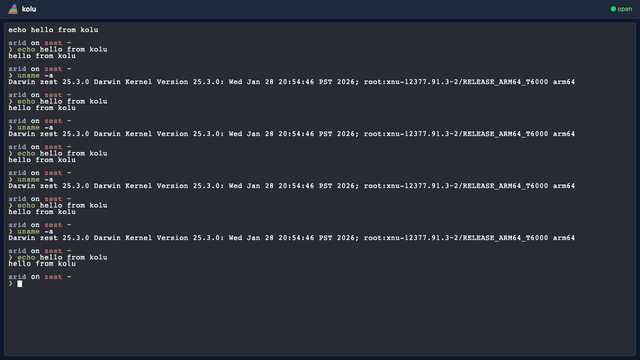

<p align="center">
  
</p>

# kolu

> [கோலு](<https://en.wikipedia.org/wiki/Golu_(festival)>) — the Navaratri tradition of arranging figures on tiered steps.

Seamless parallel development across repos and branches — switch context in one click. Optimized for AI-assisted workflows.

<p align="center">
  
</p>

> [!IMPORTANT]
> Work in progress. See the [implementation plan](docs/plans/000-KOLU.md).

## Development

Requires [Nix](https://nixos.asia/en/install) with flakes enabled.

```sh
nix develop     # enter devshell
just dev        # run server + client with hot reload
just test       # e2e tests (full nix build)
just test-dev   # e2e tests against running dev server (faster)
```

## Production

```sh
nix build       # build server + client
nix run         # serve on 0.0.0.0:7681
nix run -- --host 127.0.0.1 --port 8080  # custom bind
```

## CI

- **Nix build**: [Vira](https://vira.nixos.asia) on self-hosted NixOS runners (x86_64-linux, aarch64-darwin)
- **E2E tests**: local via `just ci` — runs Playwright and posts `signoff/e2e` commit status to GitHub

```sh
just ci         # run e2e + post signoff (requires clean worktree)
just test       # run e2e only, no signoff
```

Merging to `master` requires all three signoffs: `signoff/vira/x86_64-linux`, `signoff/vira/aarch64-darwin`, `signoff/e2e`.

## Architecture

pnpm workspace with three packages:

- `common/` — [oRPC](https://orpc.unnoq.com/) contract + [Zod](https://zod.dev/) schemas (shared types between server and client)
- `server/` — [Hono](https://hono.dev/) + [node-pty](https://github.com/microsoft/node-pty) with oRPC over WebSocket
- `client/` — [SolidJS](https://www.solidjs.com/) + [ghostty-web](https://ghostty.org) terminal

Stack: Hono → oRPC (WebSocket) → PTY → ghostty-web canvas. Styling via [Tailwind CSS v4](https://tailwindcss.com/).
