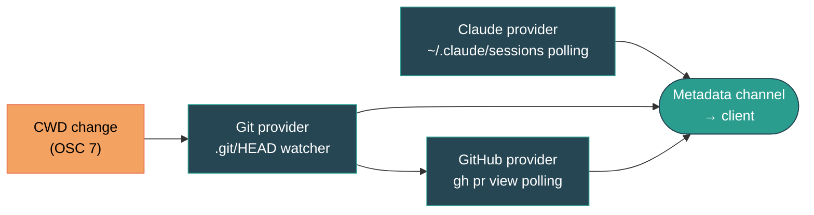
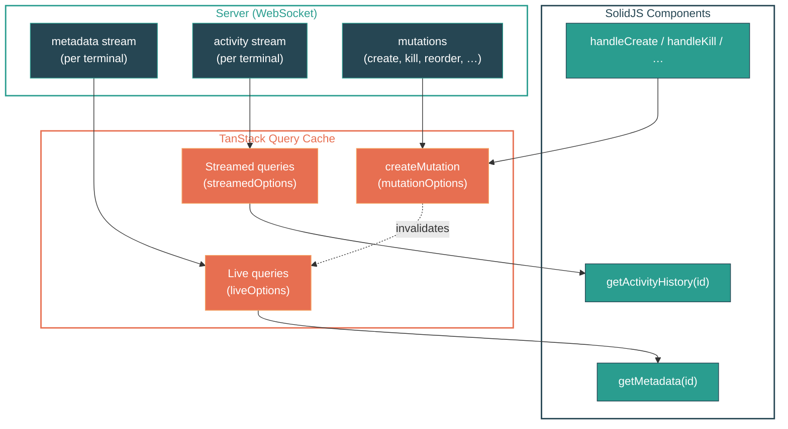

<p align="center">
  
</p>

# kolu

Web-based [Agentic Development Environment](https://x.com/jdegoes/status/2036931874057314390) (ADE) built on terminals.

Named after [கோலு](<https://en.wikipedia.org/wiki/Golu_(festival)>), the tradition of arranging figures on tiered steps.

## Usage

```sh
nix run github:juspay/kolu       # serve on 0.0.0.0:7681
nix run github:juspay/kolu -- --host 127.0.0.1 --port 8080  # custom bind
```

## Features

### Terminals

- Create, switch, kill, and drag-to-reorder terminals from a collapsible sidebar
- Sub-terminals — `Ctrl+`` splits a bottom panel per terminal; `Ctrl+Shift+``adds tabs,`Ctrl+PageDown/Up` cycles
- Font zoom (`Cmd/Ctrl +/-`), persisted per terminal across sessions
- WebGL rendering with canvas fallback, clickable URLs, Unicode 11, inline images (sixel, iTerm2, kitty)
- Lazy attach — late-joining clients receive serialized screen state (~4KB) instead of replaying raw buffer

### Navigation

- Command palette (`Cmd/Ctrl+K`) — search terminals, switch themes, run actions
- Mission Control (`Cmd/Ctrl+.` or `Ctrl+Tab`) — bird's eye grid of all terminals with live previews. Navigate with arrow keys, Tab, or number keys (1-9). `Ctrl+Tab` quick-switch uses MRU order: hold Ctrl, Tab through terminals, release to select — instant flip between two terminals
- Keyboard-driven — `Cmd+T` new terminal, `Cmd+1-9` jump, `Cmd+Shift+[/]` cycle, `Cmd+/` shortcuts help

### Git & GitHub

- Auto-detected repo name, branch, and working directory (via OSC 7 + `.git/HEAD` watcher)
- GitHub PR detection — shows PR number, title, and CI check status (pass/pending/fail) in header and sidebar
- Per-repo color coding in sidebar via golden-angle hue spacing
- Activity sparklines per terminal (5-minute rolling window)

### Claude Code Status

Detects [Claude Code](https://docs.anthropic.com/en/docs/claude-code) sessions running in any terminal and shows their state in the header and sidebar.

**What we detect:**

| State    | Indicator          | Meaning                                              |
| -------- | ------------------ | ---------------------------------------------------- |
| Thinking | Pulsing accent dot | API call in flight — Claude is generating a response |
| Tool use | Pulsing yellow dot | Claude is executing tools or waiting for permission  |
| Waiting  | Dim dot            | Claude finished responding, waiting for user input   |

**How it works:** scans `~/.claude/sessions/` for active session PIDs, matches each session to a terminal via PTY path (`/proc/{pid}/fd/0`), then tails the session's JSONL transcript to derive state from the last message.

**What we can't detect:**

- **Permission prompts vs tool execution** — both show as "tool use" since the JSONL doesn't distinguish them
- **Streaming progress** — intermediate thinking tokens aren't tracked, only final state transitions
- **macOS** — PTY matching relies on `/proc`, which doesn't exist on macOS (Linux-only for now)
- **Sub-agents** — nested agent spawns appear as tool use, not as separate tracked sessions

### Theming

- 200+ color schemes from [iTerm2-Color-Schemes](https://github.com/mbadolato/iTerm2-Color-Schemes), switchable at runtime
- Live preview while browsing themes in the palette
- Random theme per new terminal (toggleable)
- Dark / light / system UI theme

### Clipboard

- `Ctrl+V` pastes images into Claude Code via server-side clipboard shims

## Architecture

pnpm monorepo, three packages:

| Package   | Stack                                                                                                                                                               |
| --------- | ------------------------------------------------------------------------------------------------------------------------------------------------------------------- |
| `common/` | [oRPC](https://orpc.dev/) contract + [Zod](https://zod.dev/) schemas                                                                                                |
| `server/` | [Hono](https://hono.dev/) + [node-pty](https://github.com/microsoft/node-pty) + [@xterm/headless](https://www.npmjs.com/package/@xterm/headless)                    |
| `client/` | [SolidJS](https://www.solidjs.com/) + [TanStack Query](https://tanstack.com/query) + [xterm.js](https://xtermjs.org/) + [Tailwind CSS v4](https://tailwindcss.com/) |

### Communication

All traffic flows over a single WebSocket (`/rpc/ws`) via [oRPC](https://orpc.dev/). The contract in `common/` is shared by both sides — types checked at compile time, payloads validated by Zod at runtime. Three query patterns[^orpc-patterns]:

| Pattern            | Semantics                         | Used for                                            |
| ------------------ | --------------------------------- | --------------------------------------------------- |
| Request / response | one-shot                          | `terminal.create`, `terminal.resize`, `session.get` |
| Live query         | each push replaces previous value | Terminal metadata (CWD, git, PR, Claude state)      |
| Streamed query     | pushes accumulate into an array   | Activity sparklines                                 |

[^orpc-patterns]: Wired through [`@orpc/tanstack-query`](https://orpc.dev/docs/integrations/tanstack-query). Live queries use `experimental_liveOptions`; streamed queries use `experimental_streamedOptions` with `maxChunks` to cap array growth.

### Server

Hono serves HTTP and upgrades `/rpc/ws` to WebSocket for oRPC streaming.

**Terminal lifecycle** — each terminal wraps a node-pty spawn paired with an @xterm/headless instance. The headless xterm parses VT sequences server-side, enabling screen-state snapshots for late-joining clients[^lazy-attach]. Events are routed through a typed in-memory [pub/sub layer](server/src/publisher.ts) to per-terminal channels.

[^lazy-attach]: ~4 KB serialized snapshot instead of replaying the full scrollback buffer.

**Metadata providers** form a one-way DAG — each provider subscribes to upstream changes and publishes downstream. All providers feed into a single aggregated metadata channel streamed to the client:



**Persistence** — sessions auto-save to `~/.config/kolu/state.json` via [`conf`](https://github.com/sindresorhus/conf), debounced at 500 ms[^persistence].

[^persistence]: Schema is versioned with explicit migrations. Stores CWD, sort order, and parent relationships per terminal.

### Client

[SolidJS](https://www.solidjs.com/) SPA bundled by [Vite](https://vite.dev/). All server-derived state flows through [TanStack Query](https://tanstack.com/query) via [`@orpc/tanstack-query`](https://orpc.dev/docs/integrations/tanstack-query) — the client never makes raw RPC calls for stateful data. The oRPC contract generates type-safe query/mutation options that plug directly into TanStack's cache, deduplication, and lifecycle management.



[`useTerminalMetadata`](client/src/useTerminalMetadata.ts) creates a dynamic [`createQueries`](https://tanstack.com/query/latest/docs/framework/solid/reference/useQueries) array — one live query and one streamed query per known terminal. The array reactively resizes as terminals are added or removed. Mutations ([`useTerminalCrud`](client/src/useTerminalCrud.ts), [`useWorktreeOps`](client/src/useWorktreeOps.ts)) invalidate query keys on success to trigger refetches[^client-state].

[^client-state]: Local-only view state (active terminal, MRU order, attention flags) lives in SolidJS [signals and stores](https://docs.solidjs.com/reference/store-utilities/create-store) inside singleton `useXxx.ts` modules — separate from the TanStack cache.

[xterm.js](https://xtermjs.org/) renders terminals with WebGL acceleration, clickable URLs, image protocols (sixel, iTerm2, kitty), and search. [PartySocket](https://docs.partykit.io/reference/partysocket-api/) handles auto-reconnect; server restarts are detected via a `processId` probe.

### Build & packaging

Packaged with [Nix](https://nixos.asia/en/install). The flake has **zero inputs** — nixpkgs and other sources are pinned via [npins](https://github.com/andir/npins) and imported with `fetchTarball` to keep `nix develop` fast (~2.6 s cold). Shared env vars are defined once in `koluEnv` and consumed by both the build and the devShell[^build].

[^build]: `koluEnv` includes `KOLU_THEMES_JSON`, font paths, and clipboard shims. The final derivation is a wrapper script that sets the environment and execs [`tsx`](https://tsx.is/).

## Development

Requires [Nix](https://nixos.asia/en/install) with flakes enabled.

```sh
nix develop     # enter devshell
just dev        # run server + client with hot reload
just test       # e2e tests (full nix build)
```

## CI

`just ci` builds all flake outputs on x86_64-linux and aarch64-darwin in parallel, runs e2e tests, and posts GitHub commit statuses. See [`ci/`](ci/) for details and reuse instructions.

```sh
just ci              # full CI run
just ci::protect     # set branch protection
just ci::_summary    # check current status
```

## Deployment (NixOS + home-manager)

A home-manager module runs kolu as a systemd user service:

```nix
{
  imports = [ kolu.homeManagerModules.default ];
  services.kolu = {
    enable = true;
    package = kolu.packages.${system}.default;
    host = "127.0.0.1"; # default
    port = 7681;         # default
  };
}
```

See [`nix/home/example/`](nix/home/example/) for a full configuration with a VM test.
