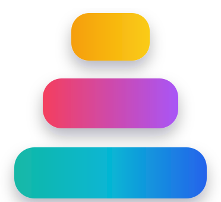
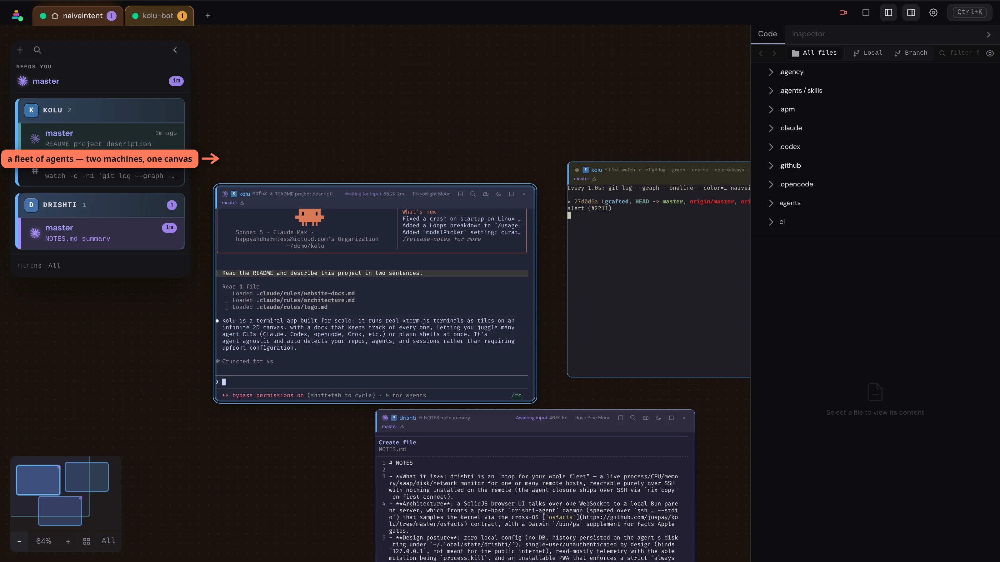

<p align="center">
  
</p>

# kolu

kolu is a terminal app built for scale: real `xterm.js` tiles on an infinite
2D canvas, with a dock that never loses one — for `claude`, `codex`,
`opencode`, `grok`, `xyne`, or anything you run in a shell, especially many
at once.

<p align="center">
  <a href="https://kolu.dev">
    
  </a>
</p>

<p align="center">
  <a href="https://kolu.dev">Documentation</a> ·
  <a href="https://kolu.dev/start">Start</a> ·
  <a href="https://kolu.dev/from-a-mac">From a Mac</a> ·
  <a href="CONTRIBUTING.md">Contributing</a> ·
  <a href="LICENSE">AGPL-3.0-or-later</a>
</p>

## Run it

[Install Nix](https://nixos.asia/en/install) with flakes enabled, then:

```sh
nix --refresh run github:juspay/kolu -- web
```

Open <http://127.0.0.1:7681>. Continue with
[Start](https://kolu.dev/start), the [Quickstart](https://kolu.dev/quickstart),
and [First Five Minutes](https://kolu.dev/first-five-minutes).

The usual setup is a [Mac window onto a headless Linux box](https://kolu.dev/from-a-mac).

If the first run starts **compiling** instead of downloading, enable kolu's
binary cache — see
[Deployment](https://kolu.dev/deployment#first-run-compiling-enable-the-binary-cache).

## Why kolu

Unlike an agent command center that wraps one model behind its own chat UI,
kolu keeps the terminal as the universal interface. Any agent CLI works out of
the box, and a plain shell is always one command away.

- **Agent-agnostic.** No agent registry, adapter, or vendor lock-in.
- **Auto-detected, zero setup.** kolu learns from the repositories, agents, and
  sessions you already use instead of asking you to configure them twice.

Read the full [Philosophy](https://kolu.dev/philosophy).

## Explore

- **[Canvas, tiles, and dock](https://kolu.dev/canvas)** — arrange real
  terminals freely, then find any one instantly.
- **[Agent attention](https://kolu.dev/agent-detection)** — see which agents are
  working, finished, or waiting for you.
- **[Durable sessions](https://kolu.dev/sessions)** — keep shells and agents
  alive across tab closes, server restarts, and redeploys.
- **[From another device](https://kolu.dev/remote-access) and
  [Add another machine](https://kolu.dev/remote-hosts)** — reach kolu from a
  phone or laptop, bring other machines onto the same canvas, and
  [forward a port](https://kolu.dev/remote-hosts#port-forwarding) so a dev
  server on any of them opens in your browser.
- **[Deployment](https://kolu.dev/deployment)** — keep kolu running as a
  home-manager service on Linux or macOS.

The complete feature guides and command reference live at
**[kolu.dev](https://kolu.dev)**. This README is the map.

## Architecture

Kolu splits the browser workspace, web shell, workspace state, and live PTYs
across processes that fail and restart independently. See the canonical
[Architecture](https://kolu.dev/architecture) page for the daemon stack, wire
protocol, data flow, and package map.

## Development

```sh
nix develop
just dev-auto
just test
```

See [Developing kolu](docs/development.md) for local instances, cleanup, and
checks; [kolu CI](ci/README.md) documents the multi-platform pipeline.

Bug fixes, build/CI fixes, documentation changes, and behavior-preserving
refactors are welcome as direct PRs. New user-facing features need a merged
proposal first. See [CONTRIBUTING.md](CONTRIBUTING.md).

The marketing site, product docs, blog, and changelog live in
[`website/`](website/); its [README](website/README.md) covers authoring and
deployment.

---

Named after [கோலு](https://en.wikipedia.org/wiki/Golu_(festival)), the
tradition of arranging figures on tiered steps.
