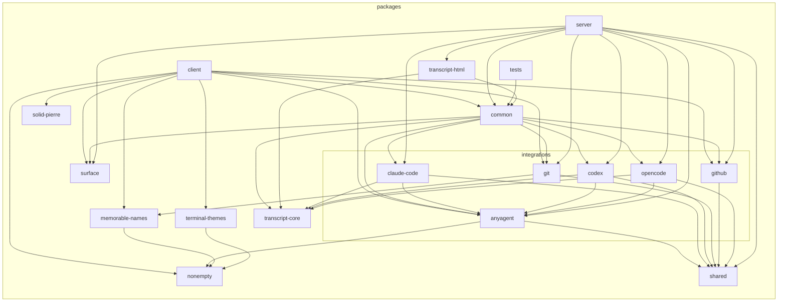
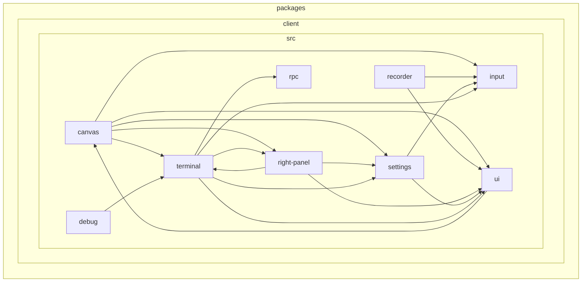

<!-- Generated by `just depcruise-graph`. Do not edit by hand. -->

# Dependency graph

Generated by [`dependency-cruiser`](https://github.com/sverweij/dependency-cruiser); regenerate with `just depcruise-graph`.

## Package overview

One node per workspace package, edges between them. Mirrors the architecture table in the top-level README.

## Module-level detail

Subfolder-level view of each workspace package — one node per `src/<dir>/` subfolder, edges aggregated. Top-level files (e.g. `App.tsx`, `commands.tsx`) are intentionally omitted: with 30+ entry-point files in `client/`, including them turns the graph into spaghetti. To trace a specific top-level file, run `depcruise --focus "^packages/<pkg>/src/<file>"` directly. Packages with no subfolder structure (single-file leaves like `nonempty`) are omitted.

### `client`

