<!-- Generated by `just depcruise-graph`. Do not edit by hand. -->

# Dependency graph

Generated by [`dependency-cruiser`](https://github.com/sverweij/dependency-cruiser); regenerate with `just depcruise-graph`.

## Package overview

One node per workspace package, edges between them. Mirrors the architecture table in the top-level README.

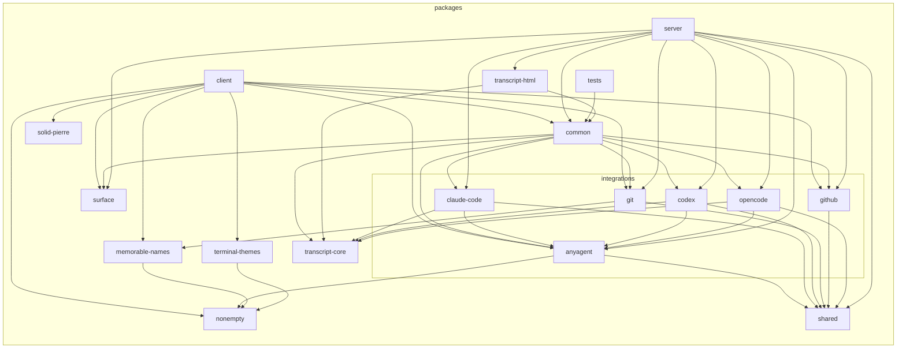

## Module-level detail

Each section below shows the internal `.ts` / `.tsx` files within one workspace package and the imports between them. Cross-package edges are excluded — those live in the overview above. Packages with a single source file are omitted.

### `client`

```mermaid
flowchart LR

subgraph packages["packages"]
  subgraph packages_client["client"]
    subgraph packages_client_src["src"]
      packages_client_src_App_tsx["App.tsx"]
      subgraph packages_client_src_canvas["canvas"]
        packages_client_src_canvas_CanvasWatermark_tsx["CanvasWatermark.tsx"]
        subgraph packages_client_src_canvas_dock["dock"]
          packages_client_src_canvas_dock_Dock_tsx["Dock.tsx"]
          packages_client_src_canvas_dock_DockMega_tsx["DockMega.tsx"]
          packages_client_src_canvas_dock_dockRowChrome_ts["dockRowChrome.ts"]
          packages_client_src_canvas_dock_dockRowRanking_ts["dockRowRanking.ts"]
          packages_client_src_canvas_dock_MobileDockDrawer_tsx["MobileDockDrawer.tsx"]
        end
        packages_client_src_canvas_dockModel_ts["dockModel.ts"]
        packages_client_src_canvas_TileLayout_ts["TileLayout.ts"]
        packages_client_src_canvas_useTileTheme_ts["useTileTheme.ts"]
        packages_client_src_canvas_tileChrome_ts["tileChrome.ts"]
        packages_client_src_canvas_useViewPosture_ts["useViewPosture.ts"]
        packages_client_src_canvas_TerminalCanvas_tsx["TerminalCanvas.tsx"]
        packages_client_src_canvas_CanvasMinimap_tsx["CanvasMinimap.tsx"]
        packages_client_src_canvas_minimapGestures_ts["minimapGestures.ts"]
        subgraph packages_client_src_canvas_viewport["viewport"]
          packages_client_src_canvas_viewport_capturePointerGesture_ts["capturePointerGesture.ts"]
          packages_client_src_canvas_viewport_useCanvasViewport_ts["useCanvasViewport.ts"]
          packages_client_src_canvas_viewport_animatedPan_ts["animatedPan.ts"]
          packages_client_src_canvas_viewport_coordinates_ts["coordinates.ts"]
          packages_client_src_canvas_viewport_transforms_ts["transforms.ts"]
          packages_client_src_canvas_viewport_gestures_ts["gestures.ts"]
        end
        packages_client_src_canvas_CanvasTile_tsx["CanvasTile.tsx"]
        packages_client_src_canvas_resizeGeometry_ts["resizeGeometry.ts"]
        packages_client_src_canvas_tilePlacement_ts["tilePlacement.ts"]
        packages_client_src_canvas_useCanvasFocus_ts["useCanvasFocus.ts"]
        packages_client_src_canvas_usePendingLayouts_ts["usePendingLayouts.ts"]
        packages_client_src_canvas_TileTitleActions_tsx["TileTitleActions.tsx"]
        packages_client_src_canvas_activeTerminal_ts["activeTerminal.ts"]
        packages_client_src_canvas_useCanvasArrange_ts["useCanvasArrange.ts"]
        packages_client_src_canvas_placementPolicy_ts["placementPolicy.ts"]
        packages_client_src_canvas_repoIslands_ts["repoIslands.ts"]
        packages_client_src_canvas_dockModel_test_ts["dockModel.test.ts"]
        packages_client_src_canvas_placementPolicy_test_ts["placementPolicy.test.ts"]
        packages_client_src_canvas_repoIslands_test_ts["repoIslands.test.ts"]
      end
      subgraph packages_client_src_input["input"]
        packages_client_src_input_keyboard_ts["keyboard.ts"]
        packages_client_src_input_platform_ts["platform.ts"]
        packages_client_src_input_actions_ts["actions.ts"]
        packages_client_src_input_useShortcuts_ts["useShortcuts.ts"]
        packages_client_src_input_zoom_ts["zoom.ts"]
        packages_client_src_input_keyboard_test_ts["keyboard.test.ts"]
      end
      subgraph packages_client_src_terminal["terminal"]
        packages_client_src_terminal_AgentIndicator_tsx["AgentIndicator.tsx"]
        packages_client_src_terminal_bufferTail_ts["bufferTail.ts"]
        packages_client_src_terminal_staleness_ts["staleness.ts"]
        packages_client_src_terminal_activityWindow_ts["activityWindow.ts"]
        packages_client_src_terminal_terminalDisplay_ts["terminalDisplay.ts"]
        packages_client_src_terminal_terminalRefs_ts["terminalRefs.ts"]
        packages_client_src_terminal_useTerminalStore_ts["useTerminalStore.ts"]
        packages_client_src_terminal_useTerminalMetadata_ts["useTerminalMetadata.ts"]
        packages_client_src_terminal_useSubPanel_ts["useSubPanel.ts"]
        packages_client_src_terminal_useTerminalCrud_ts["useTerminalCrud.ts"]
        packages_client_src_terminal_clipboard_ts["clipboard.ts"]
        packages_client_src_terminal_ChecksIndicator_tsx["ChecksIndicator.tsx"]
        packages_client_src_terminal_useTerminalDiagnostics_ts["useTerminalDiagnostics.ts"]
        packages_client_src_terminal_webglTracker_ts["webglTracker.ts"]
        packages_client_src_terminal_TerminalMeta_tsx["TerminalMeta.tsx"]
        packages_client_src_terminal_PrUnavailablePopover_tsx["PrUnavailablePopover.tsx"]
        packages_client_src_terminal_TerminalContent_tsx["TerminalContent.tsx"]
        packages_client_src_terminal_SubPanelTabBar_tsx["SubPanelTabBar.tsx"]
        packages_client_src_terminal_Terminal_tsx["Terminal.tsx"]
        packages_client_src_terminal_fileRefLinkProvider_ts["fileRefLinkProvider.ts"]
        packages_client_src_terminal_ScrollToBottom_tsx["ScrollToBottom.tsx"]
        packages_client_src_terminal_SearchBar_tsx["SearchBar.tsx"]
        packages_client_src_terminal_useTerminals_ts["useTerminals.ts"]
        packages_client_src_terminal_terminalSubject_ts["terminalSubject.ts"]
        packages_client_src_terminal_useSessionRestore_ts["useSessionRestore.ts"]
        packages_client_src_terminal_useTerminalAlerts_ts["useTerminalAlerts.ts"]
        packages_client_src_terminal_useActivityAlerts_ts["useActivityAlerts.ts"]
        packages_client_src_terminal_useWorktreeOps_ts["useWorktreeOps.ts"]
        packages_client_src_terminal_staleness_test_ts["staleness.test.ts"]
        packages_client_src_terminal_terminalDisplay_test_ts["terminalDisplay.test.ts"]
      end
      subgraph packages_client_src_ui["ui"]
        packages_client_src_ui_agentDisplay_ts["agentDisplay.ts"]
        packages_client_src_ui_Icons_tsx["Icons.tsx"]
        packages_client_src_ui_useAnchoredPopover_ts["useAnchoredPopover.ts"]
        packages_client_src_ui_chromeSpacing_ts["chromeSpacing.ts"]
        packages_client_src_ui_Kbd_tsx["Kbd.tsx"]
        packages_client_src_ui_ModalDialog_tsx["ModalDialog.tsx"]
        packages_client_src_ui_Tip_tsx["Tip.tsx"]
        packages_client_src_ui_Toggle_tsx["Toggle.tsx"]
        packages_client_src_ui_SegmentedControl_tsx["SegmentedControl.tsx"]
        packages_client_src_ui_Row_tsx["Row.tsx"]
        packages_client_src_ui_Section_tsx["Section.tsx"]
        packages_client_src_ui_lineRef_ts["lineRef.ts"]
        packages_client_src_ui_pierreAdapters_ts["pierreAdapters.ts"]
        packages_client_src_ui_pierreTheme_ts["pierreTheme.ts"]
        packages_client_src_ui_CodeContextMenu_tsx["CodeContextMenu.tsx"]
        packages_client_src_ui_useLineSelection_ts["useLineSelection.ts"]
        packages_client_src_ui_lineRef_test_ts["lineRef.test.ts"]
      end
      packages_client_src_useViewState_ts["useViewState.ts"]
      packages_client_src_wire_ts["wire.ts"]
      packages_client_src_useThemeManager_ts["useThemeManager.ts"]
      subgraph packages_client_src_right_panel["right-panel"]
        packages_client_src_right_panel_useRightPanel_ts["useRightPanel.ts"]
        packages_client_src_right_panel_RightPanelLayout_tsx["RightPanelLayout.tsx"]
        packages_client_src_right_panel_RightPanel_tsx["RightPanel.tsx"]
        packages_client_src_right_panel_activeTerminalAccent_ts["activeTerminalAccent.ts"]
        packages_client_src_right_panel_CodeTab_tsx["CodeTab.tsx"]
        packages_client_src_right_panel_BrowseFileView_tsx["BrowseFileView.tsx"]
        packages_client_src_right_panel_CodeMenuFrame_tsx["CodeMenuFrame.tsx"]
        packages_client_src_right_panel_fileSearch_ts["fileSearch.ts"]
        packages_client_src_right_panel_FileSearchInput_tsx["FileSearchInput.tsx"]
        packages_client_src_right_panel_ModeChipPicker_tsx["ModeChipPicker.tsx"]
        packages_client_src_right_panel_openInCodeTab_ts["openInCodeTab.ts"]
        packages_client_src_right_panel_MetadataInspector_tsx["MetadataInspector.tsx"]
        packages_client_src_right_panel_fileSearch_test_ts["fileSearch.test.ts"]
      end
      subgraph packages_client_src_settings["settings"]
        packages_client_src_settings_tips_ts["tips.ts"]
        packages_client_src_settings_useTips_ts["useTips.ts"]
        packages_client_src_settings_SettingsPopover_tsx["SettingsPopover.tsx"]
        packages_client_src_settings_SettingRow_tsx["SettingRow.tsx"]
        packages_client_src_settings_useColorScheme_ts["useColorScheme.ts"]
      end
      packages_client_src_CommandPalette_tsx["CommandPalette.tsx"]
      packages_client_src_useMobile_ts["useMobile.ts"]
      packages_client_src_ChromeBar_tsx["ChromeBar.tsx"]
      subgraph packages_client_src_recorder["recorder"]
        packages_client_src_recorder_RecordButton_tsx["RecordButton.tsx"]
        packages_client_src_recorder_RecordPopover_tsx["RecordPopover.tsx"]
        packages_client_src_recorder_LevelMeter_tsx["LevelMeter.tsx"]
        packages_client_src_recorder_useRecorder_ts["useRecorder.ts"]
        packages_client_src_recorder_mic_ts["mic.ts"]
        packages_client_src_recorder_webcam_ts["webcam.ts"]
        packages_client_src_recorder_WebcamOverlay_tsx["WebcamOverlay.tsx"]
      end
      subgraph packages_client_src_rpc["rpc"]
        packages_client_src_rpc_rpc_ts["rpc.ts"]
        packages_client_src_rpc_TransportOverlay_tsx["TransportOverlay.tsx"]
        packages_client_src_rpc_streamCleanup_ts["streamCleanup.ts"]
      end
      packages_client_src_CloseConfirm_tsx["CloseConfirm.tsx"]
      packages_client_src_commands_ts["commands.ts"]
      packages_client_src_DiagnosticInfo_tsx["DiagnosticInfo.tsx"]
      packages_client_src_EmptyState_tsx["EmptyState.tsx"]
      packages_client_src_exportScrollbackAsPdf_ts["exportScrollbackAsPdf.ts"]
      packages_client_src_exportSessionAsHtml_ts["exportSessionAsHtml.ts"]
      packages_client_src_MobileKeyBar_tsx["MobileKeyBar.tsx"]
      packages_client_src_MobileTileView_tsx["MobileTileView.tsx"]
      packages_client_src_MobileChromeSheet_tsx["MobileChromeSheet.tsx"]
      packages_client_src_pwa_ts["pwa.ts"]
      packages_client_src_screenshotTerminal_ts["screenshotTerminal.ts"]
      packages_client_src_ShortcutsHelp_tsx["ShortcutsHelp.tsx"]
      packages_client_src_refitOnTabVisible_ts["refitOnTabVisible.ts"]
      packages_client_src_scrollLock_ts["scrollLock.ts"]
      packages_client_src_SplitStrip_tsx["SplitStrip.tsx"]
      subgraph packages_client_src_debug["debug"]
        packages_client_src_debug_consoleHooks_ts["consoleHooks.ts"]
      end
      packages_client_src_index_tsx["index.tsx"]
      packages_client_src_index_css["index.css"]
      packages_client_src_path_test_ts["path.test.ts"]
      packages_client_src_vite_env_d_ts["vite-env.d.ts"]
    end
    packages_client_vite_config_ts["vite.config.ts"]
    packages_client_vitest_config_ts["vitest.config.ts"]
  end
end
packages_client_src_App_tsx-->packages_client_src_canvas_CanvasWatermark_tsx
packages_client_src_App_tsx-->packages_client_src_canvas_dock_Dock_tsx
packages_client_src_App_tsx-->packages_client_src_canvas_dock_dockRowRanking_ts
packages_client_src_App_tsx-->packages_client_src_canvas_dockModel_ts
packages_client_src_App_tsx-->packages_client_src_canvas_TerminalCanvas_tsx
packages_client_src_App_tsx-->packages_client_src_canvas_TileTitleActions_tsx
packages_client_src_App_tsx-->packages_client_src_canvas_useCanvasArrange_ts
packages_client_src_App_tsx-->packages_client_src_ChromeBar_tsx
packages_client_src_App_tsx-->packages_client_src_CloseConfirm_tsx
packages_client_src_App_tsx-->packages_client_src_CommandPalette_tsx
packages_client_src_App_tsx-->packages_client_src_commands_ts
packages_client_src_App_tsx-->packages_client_src_DiagnosticInfo_tsx
packages_client_src_App_tsx-->packages_client_src_EmptyState_tsx
packages_client_src_App_tsx-->packages_client_src_exportScrollbackAsPdf_ts
packages_client_src_App_tsx-->packages_client_src_exportSessionAsHtml_ts
packages_client_src_App_tsx-->packages_client_src_input_actions_ts
packages_client_src_App_tsx-->packages_client_src_input_useShortcuts_ts
packages_client_src_App_tsx-->packages_client_src_MobileKeyBar_tsx
packages_client_src_App_tsx-->packages_client_src_MobileTileView_tsx
packages_client_src_App_tsx-->packages_client_src_recorder_useRecorder_ts
packages_client_src_App_tsx-->packages_client_src_recorder_WebcamOverlay_tsx
packages_client_src_App_tsx-->packages_client_src_right_panel_RightPanelLayout_tsx
packages_client_src_App_tsx-->packages_client_src_right_panel_useRightPanel_ts
packages_client_src_App_tsx-->packages_client_src_rpc_rpc_ts
packages_client_src_App_tsx-->packages_client_src_rpc_TransportOverlay_tsx
packages_client_src_App_tsx-->packages_client_src_screenshotTerminal_ts
packages_client_src_App_tsx-->packages_client_src_settings_useColorScheme_ts
packages_client_src_App_tsx-->packages_client_src_settings_useTips_ts
packages_client_src_App_tsx-->packages_client_src_ShortcutsHelp_tsx
packages_client_src_App_tsx-->packages_client_src_terminal_staleness_ts
packages_client_src_App_tsx-->packages_client_src_terminal_TerminalContent_tsx
packages_client_src_App_tsx-->packages_client_src_terminal_TerminalMeta_tsx
packages_client_src_App_tsx-->packages_client_src_terminal_useSubPanel_ts
packages_client_src_App_tsx-->packages_client_src_terminal_useTerminals_ts
packages_client_src_App_tsx-->packages_client_src_ui_ModalDialog_tsx
packages_client_src_App_tsx-->packages_client_src_useMobile_ts
packages_client_src_App_tsx-->packages_client_src_useThemeManager_ts
packages_client_src_App_tsx-->packages_client_src_wire_ts
packages_client_src_canvas_dock_Dock_tsx-->packages_client_src_input_keyboard_ts
packages_client_src_canvas_dock_Dock_tsx-->packages_client_src_terminal_AgentIndicator_tsx
packages_client_src_canvas_dock_Dock_tsx-->packages_client_src_terminal_bufferTail_ts
packages_client_src_canvas_dock_Dock_tsx-->packages_client_src_terminal_staleness_ts
packages_client_src_canvas_dock_Dock_tsx-->packages_client_src_terminal_terminalDisplay_ts
packages_client_src_canvas_dock_Dock_tsx-->packages_client_src_terminal_terminalRefs_ts
packages_client_src_canvas_dock_Dock_tsx-->packages_client_src_terminal_useTerminalStore_ts
packages_client_src_canvas_dock_Dock_tsx-->packages_client_src_ui_Icons_tsx
packages_client_src_canvas_dock_Dock_tsx-->packages_client_src_wire_ts
packages_client_src_canvas_dock_Dock_tsx-->packages_client_src_canvas_dockModel_ts
packages_client_src_canvas_dock_Dock_tsx-->packages_client_src_canvas_useTileTheme_ts
packages_client_src_canvas_dock_Dock_tsx-->packages_client_src_canvas_useViewPosture_ts
packages_client_src_canvas_dock_Dock_tsx-->packages_client_src_canvas_dock_DockMega_tsx
packages_client_src_canvas_dock_Dock_tsx-->packages_client_src_canvas_dock_dockRowChrome_ts
packages_client_src_canvas_dock_Dock_tsx-->packages_client_src_canvas_dock_dockRowRanking_ts
packages_client_src_input_keyboard_ts-->packages_client_src_input_platform_ts
packages_client_src_terminal_AgentIndicator_tsx-->packages_client_src_ui_agentDisplay_ts
packages_client_src_ui_agentDisplay_ts-->packages_client_src_ui_Icons_tsx
packages_client_src_terminal_staleness_ts-->packages_client_src_terminal_activityWindow_ts
packages_client_src_terminal_useTerminalStore_ts-->packages_client_src_useViewState_ts
packages_client_src_terminal_useTerminalStore_ts-->packages_client_src_wire_ts
packages_client_src_terminal_useTerminalStore_ts-->packages_client_src_terminal_useTerminalMetadata_ts
packages_client_src_useViewState_ts-->packages_client_src_wire_ts
packages_client_src_terminal_useTerminalMetadata_ts-->packages_client_src_wire_ts
packages_client_src_terminal_useTerminalMetadata_ts-->packages_client_src_terminal_terminalDisplay_ts
packages_client_src_canvas_dockModel_ts-->packages_client_src_terminal_activityWindow_ts
packages_client_src_canvas_dockModel_ts-->packages_client_src_terminal_terminalDisplay_ts
packages_client_src_canvas_dockModel_ts-->packages_client_src_canvas_TileLayout_ts
packages_client_src_canvas_useTileTheme_ts-->packages_client_src_useThemeManager_ts
packages_client_src_canvas_useTileTheme_ts-->packages_client_src_canvas_tileChrome_ts
packages_client_src_useThemeManager_ts-->packages_client_src_terminal_useTerminalStore_ts
packages_client_src_useThemeManager_ts-->packages_client_src_wire_ts
packages_client_src_canvas_useViewPosture_ts-->packages_client_src_terminal_useTerminalStore_ts
packages_client_src_canvas_dock_DockMega_tsx-->packages_client_src_terminal_staleness_ts
packages_client_src_canvas_dock_DockMega_tsx-->packages_client_src_terminal_useTerminalStore_ts
packages_client_src_canvas_dock_DockMega_tsx-->packages_client_src_ui_Icons_tsx
packages_client_src_canvas_dock_DockMega_tsx-->packages_client_src_canvas_dockModel_ts
packages_client_src_canvas_dock_DockMega_tsx-->packages_client_src_canvas_useTileTheme_ts
packages_client_src_canvas_dock_DockMega_tsx-->packages_client_src_canvas_dock_dockRowChrome_ts
packages_client_src_canvas_dock_dockRowChrome_ts-->packages_client_src_ui_agentDisplay_ts
packages_client_src_canvas_dock_dockRowChrome_ts-->packages_client_src_canvas_dockModel_ts
packages_client_src_canvas_dock_dockRowRanking_ts-->packages_client_src_canvas_dockModel_ts
packages_client_src_canvas_TerminalCanvas_tsx-->packages_client_src_terminal_staleness_ts
packages_client_src_canvas_TerminalCanvas_tsx-->packages_client_src_terminal_useTerminalStore_ts
packages_client_src_canvas_TerminalCanvas_tsx-->packages_client_src_wire_ts
packages_client_src_canvas_TerminalCanvas_tsx-->packages_client_src_canvas_CanvasMinimap_tsx
packages_client_src_canvas_TerminalCanvas_tsx-->packages_client_src_canvas_CanvasTile_tsx
packages_client_src_canvas_TerminalCanvas_tsx-->packages_client_src_canvas_CanvasWatermark_tsx
packages_client_src_canvas_TerminalCanvas_tsx-->packages_client_src_canvas_dock_Dock_tsx
packages_client_src_canvas_TerminalCanvas_tsx-->packages_client_src_canvas_dockModel_ts
packages_client_src_canvas_TerminalCanvas_tsx-->packages_client_src_canvas_resizeGeometry_ts
packages_client_src_canvas_TerminalCanvas_tsx-->packages_client_src_canvas_TileLayout_ts
packages_client_src_canvas_TerminalCanvas_tsx-->packages_client_src_canvas_tilePlacement_ts
packages_client_src_canvas_TerminalCanvas_tsx-->packages_client_src_canvas_useCanvasFocus_ts
packages_client_src_canvas_TerminalCanvas_tsx-->packages_client_src_canvas_usePendingLayouts_ts
packages_client_src_canvas_TerminalCanvas_tsx-->packages_client_src_canvas_useTileTheme_ts
packages_client_src_canvas_TerminalCanvas_tsx-->packages_client_src_canvas_useViewPosture_ts
packages_client_src_canvas_TerminalCanvas_tsx-->packages_client_src_canvas_viewport_capturePointerGesture_ts
packages_client_src_canvas_TerminalCanvas_tsx-->packages_client_src_canvas_viewport_useCanvasViewport_ts
packages_client_src_canvas_CanvasMinimap_tsx-->packages_client_src_terminal_activityWindow_ts
packages_client_src_canvas_CanvasMinimap_tsx-->packages_client_src_terminal_staleness_ts
packages_client_src_canvas_CanvasMinimap_tsx-->packages_client_src_terminal_terminalDisplay_ts
packages_client_src_canvas_CanvasMinimap_tsx-->packages_client_src_terminal_useTerminalStore_ts
packages_client_src_canvas_CanvasMinimap_tsx-->packages_client_src_ui_Icons_tsx
packages_client_src_canvas_CanvasMinimap_tsx-->packages_client_src_ui_useAnchoredPopover_ts
packages_client_src_canvas_CanvasMinimap_tsx-->packages_client_src_canvas_dockModel_ts
packages_client_src_canvas_CanvasMinimap_tsx-->packages_client_src_canvas_minimapGestures_ts
packages_client_src_canvas_CanvasMinimap_tsx-->packages_client_src_canvas_TileLayout_ts
packages_client_src_canvas_CanvasMinimap_tsx-->packages_client_src_canvas_useTileTheme_ts
packages_client_src_canvas_CanvasMinimap_tsx-->packages_client_src_canvas_viewport_useCanvasViewport_ts
packages_client_src_canvas_minimapGestures_ts-->packages_client_src_canvas_viewport_capturePointerGesture_ts
packages_client_src_canvas_minimapGestures_ts-->packages_client_src_canvas_viewport_useCanvasViewport_ts
packages_client_src_canvas_viewport_useCanvasViewport_ts-->packages_client_src_canvas_TileLayout_ts
packages_client_src_canvas_viewport_useCanvasViewport_ts-->packages_client_src_canvas_viewport_animatedPan_ts
packages_client_src_canvas_viewport_useCanvasViewport_ts-->packages_client_src_canvas_viewport_coordinates_ts
packages_client_src_canvas_viewport_useCanvasViewport_ts-->packages_client_src_canvas_viewport_gestures_ts
packages_client_src_canvas_viewport_useCanvasViewport_ts-->packages_client_src_canvas_viewport_transforms_ts
packages_client_src_canvas_viewport_coordinates_ts-->packages_client_src_canvas_viewport_transforms_ts
packages_client_src_canvas_viewport_gestures_ts-->packages_client_src_canvas_viewport_capturePointerGesture_ts
packages_client_src_canvas_CanvasTile_tsx-->packages_client_src_ui_chromeSpacing_ts
packages_client_src_canvas_CanvasTile_tsx-->packages_client_src_ui_Icons_tsx
packages_client_src_canvas_CanvasTile_tsx-->packages_client_src_canvas_resizeGeometry_ts
packages_client_src_canvas_CanvasTile_tsx-->packages_client_src_canvas_tileChrome_ts
packages_client_src_canvas_CanvasTile_tsx-->packages_client_src_canvas_TileLayout_ts
packages_client_src_canvas_CanvasTile_tsx-->packages_client_src_canvas_tilePlacement_ts
packages_client_src_canvas_resizeGeometry_ts-->packages_client_src_canvas_TileLayout_ts
packages_client_src_canvas_tilePlacement_ts-->packages_client_src_canvas_viewport_transforms_ts
packages_client_src_canvas_useCanvasFocus_ts-->packages_client_src_terminal_useTerminalStore_ts
packages_client_src_canvas_usePendingLayouts_ts-->packages_client_src_canvas_TileLayout_ts
packages_client_src_canvas_TileTitleActions_tsx-->packages_client_src_right_panel_useRightPanel_ts
packages_client_src_canvas_TileTitleActions_tsx-->packages_client_src_settings_tips_ts
packages_client_src_canvas_TileTitleActions_tsx-->packages_client_src_settings_useTips_ts
packages_client_src_canvas_TileTitleActions_tsx-->packages_client_src_terminal_AgentIndicator_tsx
packages_client_src_canvas_TileTitleActions_tsx-->packages_client_src_terminal_useSubPanel_ts
packages_client_src_canvas_TileTitleActions_tsx-->packages_client_src_terminal_useTerminalStore_ts
packages_client_src_canvas_TileTitleActions_tsx-->packages_client_src_ui_Icons_tsx
packages_client_src_canvas_TileTitleActions_tsx-->packages_client_src_ui_Tip_tsx
packages_client_src_canvas_TileTitleActions_tsx-->packages_client_src_useThemeManager_ts
packages_client_src_right_panel_useRightPanel_ts-->packages_client_src_wire_ts
packages_client_src_settings_tips_ts-->packages_client_src_input_actions_ts
packages_client_src_settings_tips_ts-->packages_client_src_input_keyboard_ts
packages_client_src_input_actions_ts-->packages_client_src_CommandPalette_tsx
packages_client_src_input_actions_ts-->packages_client_src_input_keyboard_ts
packages_client_src_CommandPalette_tsx-->packages_client_src_input_keyboard_ts
packages_client_src_CommandPalette_tsx-->packages_client_src_settings_useTips_ts
packages_client_src_CommandPalette_tsx-->packages_client_src_ui_Kbd_tsx
packages_client_src_CommandPalette_tsx-->packages_client_src_ui_ModalDialog_tsx
packages_client_src_settings_useTips_ts-->packages_client_src_useMobile_ts
packages_client_src_settings_useTips_ts-->packages_client_src_wire_ts
packages_client_src_settings_useTips_ts-->packages_client_src_settings_tips_ts
packages_client_src_ui_ModalDialog_tsx-->packages_client_src_canvas_activeTerminal_ts
packages_client_src_terminal_useSubPanel_ts-->packages_client_src_wire_ts
packages_client_src_canvas_useCanvasArrange_ts-->packages_client_src_terminal_useTerminalCrud_ts
packages_client_src_canvas_useCanvasArrange_ts-->packages_client_src_terminal_useTerminalStore_ts
packages_client_src_canvas_useCanvasArrange_ts-->packages_client_src_canvas_placementPolicy_ts
packages_client_src_canvas_useCanvasArrange_ts-->packages_client_src_canvas_repoIslands_ts
packages_client_src_canvas_useCanvasArrange_ts-->packages_client_src_canvas_TileLayout_ts
packages_client_src_canvas_useCanvasArrange_ts-->packages_client_src_canvas_usePendingLayouts_ts
packages_client_src_terminal_useTerminalCrud_ts-->packages_client_src_settings_tips_ts
packages_client_src_terminal_useTerminalCrud_ts-->packages_client_src_settings_useTips_ts
packages_client_src_terminal_useTerminalCrud_ts-->packages_client_src_wire_ts
packages_client_src_terminal_useTerminalCrud_ts-->packages_client_src_terminal_clipboard_ts
packages_client_src_terminal_useTerminalCrud_ts-->packages_client_src_terminal_useSubPanel_ts
packages_client_src_terminal_useTerminalCrud_ts-->packages_client_src_terminal_useTerminalStore_ts
packages_client_src_canvas_placementPolicy_ts-->packages_client_src_terminal_useTerminalStore_ts
packages_client_src_canvas_repoIslands_ts-->packages_client_src_canvas_TileLayout_ts
packages_client_src_canvas_repoIslands_ts-->packages_client_src_canvas_tilePlacement_ts
packages_client_src_canvas_repoIslands_ts-->packages_client_src_canvas_viewport_transforms_ts
packages_client_src_ChromeBar_tsx-->packages_client_src_canvas_dock_Dock_tsx
packages_client_src_ChromeBar_tsx-->packages_client_src_canvas_useViewPosture_ts
packages_client_src_ChromeBar_tsx-->packages_client_src_input_actions_ts
packages_client_src_ChromeBar_tsx-->packages_client_src_input_keyboard_ts
packages_client_src_ChromeBar_tsx-->packages_client_src_recorder_RecordButton_tsx
packages_client_src_ChromeBar_tsx-->packages_client_src_right_panel_useRightPanel_ts
packages_client_src_ChromeBar_tsx-->packages_client_src_rpc_rpc_ts
packages_client_src_ChromeBar_tsx-->packages_client_src_settings_SettingsPopover_tsx
packages_client_src_ChromeBar_tsx-->packages_client_src_ui_Icons_tsx
packages_client_src_ChromeBar_tsx-->packages_client_src_ui_Kbd_tsx
packages_client_src_ChromeBar_tsx-->packages_client_src_ui_Tip_tsx
packages_client_src_recorder_RecordButton_tsx-->packages_client_src_input_actions_ts
packages_client_src_recorder_RecordButton_tsx-->packages_client_src_input_keyboard_ts
packages_client_src_recorder_RecordButton_tsx-->packages_client_src_ui_Icons_tsx
packages_client_src_recorder_RecordButton_tsx-->packages_client_src_ui_Tip_tsx
packages_client_src_recorder_RecordButton_tsx-->packages_client_src_recorder_RecordPopover_tsx
packages_client_src_recorder_RecordButton_tsx-->packages_client_src_recorder_useRecorder_ts
packages_client_src_recorder_RecordPopover_tsx-->packages_client_src_ui_Toggle_tsx
packages_client_src_recorder_RecordPopover_tsx-->packages_client_src_ui_useAnchoredPopover_ts
packages_client_src_recorder_RecordPopover_tsx-->packages_client_src_recorder_LevelMeter_tsx
packages_client_src_recorder_RecordPopover_tsx-->packages_client_src_recorder_useRecorder_ts
packages_client_src_recorder_useRecorder_ts-->packages_client_src_recorder_mic_ts
packages_client_src_recorder_useRecorder_ts-->packages_client_src_recorder_webcam_ts
packages_client_src_rpc_rpc_ts-->packages_client_src_wire_ts
packages_client_src_settings_SettingsPopover_tsx-->packages_client_src_ui_SegmentedControl_tsx
packages_client_src_settings_SettingsPopover_tsx-->packages_client_src_ui_Toggle_tsx
packages_client_src_settings_SettingsPopover_tsx-->packages_client_src_ui_useAnchoredPopover_ts
packages_client_src_settings_SettingsPopover_tsx-->packages_client_src_wire_ts
packages_client_src_settings_SettingsPopover_tsx-->packages_client_src_settings_SettingRow_tsx
packages_client_src_settings_SettingsPopover_tsx-->packages_client_src_settings_useColorScheme_ts
packages_client_src_settings_useColorScheme_ts-->packages_client_src_wire_ts
packages_client_src_CloseConfirm_tsx-->packages_client_src_terminal_ChecksIndicator_tsx
packages_client_src_CloseConfirm_tsx-->packages_client_src_ui_Icons_tsx
packages_client_src_CloseConfirm_tsx-->packages_client_src_ui_ModalDialog_tsx
packages_client_src_commands_ts-->packages_client_src_CommandPalette_tsx
packages_client_src_commands_ts-->packages_client_src_input_actions_ts
packages_client_src_commands_ts-->packages_client_src_ui_agentDisplay_ts
packages_client_src_commands_ts-->packages_client_src_ui_Icons_tsx
packages_client_src_commands_ts-->packages_client_src_wire_ts
packages_client_src_DiagnosticInfo_tsx-->packages_client_src_rpc_rpc_ts
packages_client_src_DiagnosticInfo_tsx-->packages_client_src_terminal_terminalRefs_ts
packages_client_src_DiagnosticInfo_tsx-->packages_client_src_terminal_useTerminalDiagnostics_ts
packages_client_src_DiagnosticInfo_tsx-->packages_client_src_terminal_webglTracker_ts
packages_client_src_DiagnosticInfo_tsx-->packages_client_src_ui_ModalDialog_tsx
packages_client_src_DiagnosticInfo_tsx-->packages_client_src_ui_Row_tsx
packages_client_src_DiagnosticInfo_tsx-->packages_client_src_ui_Section_tsx
packages_client_src_DiagnosticInfo_tsx-->packages_client_src_useMobile_ts
packages_client_src_EmptyState_tsx-->packages_client_src_input_actions_ts
packages_client_src_EmptyState_tsx-->packages_client_src_input_keyboard_ts
packages_client_src_EmptyState_tsx-->packages_client_src_ui_Kbd_tsx
packages_client_src_EmptyState_tsx-->packages_client_src_ui_Toggle_tsx
packages_client_src_exportScrollbackAsPdf_ts-->packages_client_src_terminal_terminalRefs_ts
packages_client_src_exportSessionAsHtml_ts-->packages_client_src_wire_ts
packages_client_src_input_useShortcuts_ts-->packages_client_src_input_actions_ts
packages_client_src_input_useShortcuts_ts-->packages_client_src_input_keyboard_ts
packages_client_src_MobileKeyBar_tsx-->packages_client_src_useMobile_ts
packages_client_src_MobileKeyBar_tsx-->packages_client_src_wire_ts
packages_client_src_MobileTileView_tsx-->packages_client_src_canvas_dock_MobileDockDrawer_tsx
packages_client_src_MobileTileView_tsx-->packages_client_src_MobileChromeSheet_tsx
packages_client_src_MobileTileView_tsx-->packages_client_src_rpc_rpc_ts
packages_client_src_MobileTileView_tsx-->packages_client_src_terminal_TerminalMeta_tsx
packages_client_src_MobileTileView_tsx-->packages_client_src_terminal_useTerminalStore_ts
packages_client_src_canvas_dock_MobileDockDrawer_tsx-->packages_client_src_terminal_AgentIndicator_tsx
packages_client_src_canvas_dock_MobileDockDrawer_tsx-->packages_client_src_terminal_staleness_ts
packages_client_src_canvas_dock_MobileDockDrawer_tsx-->packages_client_src_terminal_useTerminalStore_ts
packages_client_src_canvas_dock_MobileDockDrawer_tsx-->packages_client_src_canvas_dock_dockRowChrome_ts
packages_client_src_canvas_dock_MobileDockDrawer_tsx-->packages_client_src_canvas_dock_dockRowRanking_ts
packages_client_src_MobileChromeSheet_tsx-->packages_client_src_input_actions_ts
packages_client_src_MobileChromeSheet_tsx-->packages_client_src_input_keyboard_ts
packages_client_src_MobileChromeSheet_tsx-->packages_client_src_right_panel_useRightPanel_ts
packages_client_src_MobileChromeSheet_tsx-->packages_client_src_rpc_rpc_ts
packages_client_src_MobileChromeSheet_tsx-->packages_client_src_settings_SettingsPopover_tsx
packages_client_src_MobileChromeSheet_tsx-->packages_client_src_ui_Icons_tsx
packages_client_src_MobileChromeSheet_tsx-->packages_client_src_ui_Kbd_tsx
packages_client_src_terminal_TerminalMeta_tsx-->packages_client_src_ui_Icons_tsx
packages_client_src_terminal_TerminalMeta_tsx-->packages_client_src_ui_Tip_tsx
packages_client_src_terminal_TerminalMeta_tsx-->packages_client_src_terminal_ChecksIndicator_tsx
packages_client_src_terminal_TerminalMeta_tsx-->packages_client_src_terminal_clipboard_ts
packages_client_src_terminal_TerminalMeta_tsx-->packages_client_src_terminal_PrUnavailablePopover_tsx
packages_client_src_terminal_TerminalMeta_tsx-->packages_client_src_terminal_terminalDisplay_ts
packages_client_src_terminal_PrUnavailablePopover_tsx-->packages_client_src_ui_Icons_tsx
packages_client_src_terminal_PrUnavailablePopover_tsx-->packages_client_src_ui_useAnchoredPopover_ts
packages_client_src_terminal_PrUnavailablePopover_tsx-->packages_client_src_terminal_clipboard_ts
packages_client_src_recorder_WebcamOverlay_tsx-->packages_client_src_recorder_useRecorder_ts
packages_client_src_right_panel_RightPanelLayout_tsx-->packages_client_src_useMobile_ts
packages_client_src_right_panel_RightPanelLayout_tsx-->packages_client_src_right_panel_RightPanel_tsx
packages_client_src_right_panel_RightPanelLayout_tsx-->packages_client_src_right_panel_useRightPanel_ts
packages_client_src_right_panel_RightPanel_tsx-->packages_client_src_ui_chromeSpacing_ts
packages_client_src_right_panel_RightPanel_tsx-->packages_client_src_ui_Icons_tsx
packages_client_src_right_panel_RightPanel_tsx-->packages_client_src_right_panel_activeTerminalAccent_ts
packages_client_src_right_panel_RightPanel_tsx-->packages_client_src_right_panel_CodeTab_tsx
packages_client_src_right_panel_RightPanel_tsx-->packages_client_src_right_panel_MetadataInspector_tsx
packages_client_src_right_panel_RightPanel_tsx-->packages_client_src_right_panel_useRightPanel_ts
packages_client_src_right_panel_CodeTab_tsx-->packages_client_src_settings_useColorScheme_ts
packages_client_src_right_panel_CodeTab_tsx-->packages_client_src_ui_Icons_tsx
packages_client_src_right_panel_CodeTab_tsx-->packages_client_src_ui_lineRef_ts
packages_client_src_right_panel_CodeTab_tsx-->packages_client_src_ui_pierreAdapters_ts
packages_client_src_right_panel_CodeTab_tsx-->packages_client_src_ui_pierreTheme_ts
packages_client_src_right_panel_CodeTab_tsx-->packages_client_src_wire_ts
packages_client_src_right_panel_CodeTab_tsx-->packages_client_src_right_panel_BrowseFileView_tsx
packages_client_src_right_panel_CodeTab_tsx-->packages_client_src_right_panel_CodeMenuFrame_tsx
packages_client_src_right_panel_CodeTab_tsx-->packages_client_src_right_panel_fileSearch_ts
packages_client_src_right_panel_CodeTab_tsx-->packages_client_src_right_panel_FileSearchInput_tsx
packages_client_src_right_panel_CodeTab_tsx-->packages_client_src_right_panel_ModeChipPicker_tsx
packages_client_src_right_panel_CodeTab_tsx-->packages_client_src_right_panel_openInCodeTab_ts
packages_client_src_right_panel_CodeTab_tsx-->packages_client_src_right_panel_useRightPanel_ts
packages_client_src_right_panel_BrowseFileView_tsx-->packages_client_src_ui_pierreTheme_ts
packages_client_src_right_panel_BrowseFileView_tsx-->packages_client_src_wire_ts
packages_client_src_right_panel_BrowseFileView_tsx-->packages_client_src_right_panel_CodeMenuFrame_tsx
packages_client_src_right_panel_CodeMenuFrame_tsx-->packages_client_src_ui_CodeContextMenu_tsx
packages_client_src_right_panel_CodeMenuFrame_tsx-->packages_client_src_ui_lineRef_ts
packages_client_src_right_panel_CodeMenuFrame_tsx-->packages_client_src_ui_useLineSelection_ts
packages_client_src_ui_useLineSelection_ts-->packages_client_src_ui_CodeContextMenu_tsx
packages_client_src_ui_useLineSelection_ts-->packages_client_src_ui_Icons_tsx
packages_client_src_ui_useLineSelection_ts-->packages_client_src_ui_lineRef_ts
packages_client_src_right_panel_FileSearchInput_tsx-->packages_client_src_ui_Icons_tsx
packages_client_src_right_panel_ModeChipPicker_tsx-->packages_client_src_ui_Icons_tsx
packages_client_src_right_panel_ModeChipPicker_tsx-->packages_client_src_ui_useAnchoredPopover_ts
packages_client_src_right_panel_openInCodeTab_ts-->packages_client_src_ui_lineRef_ts
packages_client_src_right_panel_openInCodeTab_ts-->packages_client_src_right_panel_useRightPanel_ts
packages_client_src_right_panel_MetadataInspector_tsx-->packages_client_src_terminal_ChecksIndicator_tsx
packages_client_src_right_panel_MetadataInspector_tsx-->packages_client_src_terminal_PrUnavailablePopover_tsx
packages_client_src_right_panel_MetadataInspector_tsx-->packages_client_src_ui_agentDisplay_ts
packages_client_src_right_panel_MetadataInspector_tsx-->packages_client_src_ui_Icons_tsx
packages_client_src_right_panel_MetadataInspector_tsx-->packages_client_src_ui_Row_tsx
packages_client_src_right_panel_MetadataInspector_tsx-->packages_client_src_ui_Section_tsx
packages_client_src_rpc_TransportOverlay_tsx-->packages_client_src_pwa_ts
packages_client_src_rpc_TransportOverlay_tsx-->packages_client_src_rpc_rpc_ts
packages_client_src_screenshotTerminal_ts-->packages_client_src_terminal_terminalRefs_ts
packages_client_src_ShortcutsHelp_tsx-->packages_client_src_input_actions_ts
packages_client_src_ShortcutsHelp_tsx-->packages_client_src_input_keyboard_ts
packages_client_src_ShortcutsHelp_tsx-->packages_client_src_ui_Kbd_tsx
packages_client_src_ShortcutsHelp_tsx-->packages_client_src_ui_ModalDialog_tsx
packages_client_src_terminal_TerminalContent_tsx-->packages_client_src_terminal_SubPanelTabBar_tsx
packages_client_src_terminal_TerminalContent_tsx-->packages_client_src_terminal_Terminal_tsx
packages_client_src_terminal_TerminalContent_tsx-->packages_client_src_terminal_useSubPanel_ts
packages_client_src_terminal_Terminal_tsx-->packages_client_src_input_actions_ts
packages_client_src_terminal_Terminal_tsx-->packages_client_src_input_keyboard_ts
packages_client_src_terminal_Terminal_tsx-->packages_client_src_input_zoom_ts
packages_client_src_terminal_Terminal_tsx-->packages_client_src_refitOnTabVisible_ts
packages_client_src_terminal_Terminal_tsx-->packages_client_src_right_panel_openInCodeTab_ts
packages_client_src_terminal_Terminal_tsx-->packages_client_src_rpc_streamCleanup_ts
packages_client_src_terminal_Terminal_tsx-->packages_client_src_scrollLock_ts
packages_client_src_terminal_Terminal_tsx-->packages_client_src_useMobile_ts
packages_client_src_terminal_Terminal_tsx-->packages_client_src_wire_ts
packages_client_src_terminal_Terminal_tsx-->packages_client_src_terminal_clipboard_ts
packages_client_src_terminal_Terminal_tsx-->packages_client_src_terminal_fileRefLinkProvider_ts
packages_client_src_terminal_Terminal_tsx-->packages_client_src_terminal_ScrollToBottom_tsx
packages_client_src_terminal_Terminal_tsx-->packages_client_src_terminal_SearchBar_tsx
packages_client_src_terminal_Terminal_tsx-->packages_client_src_terminal_terminalRefs_ts
packages_client_src_terminal_Terminal_tsx-->packages_client_src_terminal_useTerminalDiagnostics_ts
packages_client_src_terminal_Terminal_tsx-->packages_client_src_terminal_useTerminalStore_ts
packages_client_src_terminal_Terminal_tsx-->packages_client_src_terminal_webglTracker_ts
packages_client_src_input_zoom_ts-->packages_client_src_input_keyboard_ts
packages_client_src_terminal_fileRefLinkProvider_ts-->packages_client_src_ui_lineRef_ts
packages_client_src_terminal_ScrollToBottom_tsx-->packages_client_src_ui_Icons_tsx
packages_client_src_terminal_ScrollToBottom_tsx-->packages_client_src_ui_Tip_tsx
packages_client_src_terminal_SearchBar_tsx-->packages_client_src_ui_Icons_tsx
packages_client_src_terminal_SearchBar_tsx-->packages_client_src_ui_Tip_tsx
packages_client_src_terminal_useTerminals_ts-->packages_client_src_rpc_streamCleanup_ts
packages_client_src_terminal_useTerminals_ts-->packages_client_src_wire_ts
packages_client_src_terminal_useTerminals_ts-->packages_client_src_terminal_terminalSubject_ts
packages_client_src_terminal_useTerminals_ts-->packages_client_src_terminal_useSessionRestore_ts
packages_client_src_terminal_useTerminals_ts-->packages_client_src_terminal_useTerminalAlerts_ts
packages_client_src_terminal_useTerminals_ts-->packages_client_src_terminal_useTerminalCrud_ts
packages_client_src_terminal_useTerminals_ts-->packages_client_src_terminal_useTerminalStore_ts
packages_client_src_terminal_useTerminals_ts-->packages_client_src_terminal_useWorktreeOps_ts
packages_client_src_terminal_terminalSubject_ts-->packages_client_src_terminal_terminalDisplay_ts
packages_client_src_terminal_useSessionRestore_ts-->packages_client_src_rpc_rpc_ts
packages_client_src_terminal_useSessionRestore_ts-->packages_client_src_wire_ts
packages_client_src_terminal_useSessionRestore_ts-->packages_client_src_terminal_useSubPanel_ts
packages_client_src_terminal_useSessionRestore_ts-->packages_client_src_terminal_useTerminalStore_ts
packages_client_src_terminal_useTerminalAlerts_ts-->packages_client_src_ui_agentDisplay_ts
packages_client_src_terminal_useTerminalAlerts_ts-->packages_client_src_wire_ts
packages_client_src_terminal_useTerminalAlerts_ts-->packages_client_src_terminal_staleness_ts
packages_client_src_terminal_useTerminalAlerts_ts-->packages_client_src_terminal_terminalSubject_ts
packages_client_src_terminal_useTerminalAlerts_ts-->packages_client_src_terminal_useActivityAlerts_ts
packages_client_src_terminal_useActivityAlerts_ts-->packages_client_src_terminal_terminalSubject_ts
packages_client_src_terminal_useWorktreeOps_ts-->packages_client_src_wire_ts
packages_client_src_terminal_useWorktreeOps_ts-->packages_client_src_terminal_useTerminalStore_ts
packages_client_src_SplitStrip_tsx-->packages_client_src_input_actions_ts
packages_client_src_SplitStrip_tsx-->packages_client_src_input_keyboard_ts
packages_client_src_SplitStrip_tsx-->packages_client_src_ui_Kbd_tsx
packages_client_src_canvas_dockModel_test_ts-->packages_client_src_terminal_activityWindow_ts
packages_client_src_canvas_dockModel_test_ts-->packages_client_src_terminal_terminalDisplay_ts
packages_client_src_canvas_dockModel_test_ts-->packages_client_src_canvas_dockModel_ts
packages_client_src_canvas_dockModel_test_ts-->packages_client_src_canvas_TileLayout_ts
packages_client_src_canvas_placementPolicy_test_ts-->packages_client_src_terminal_terminalDisplay_ts
packages_client_src_canvas_placementPolicy_test_ts-->packages_client_src_terminal_useTerminalStore_ts
packages_client_src_canvas_placementPolicy_test_ts-->packages_client_src_canvas_placementPolicy_ts
packages_client_src_canvas_repoIslands_test_ts-->packages_client_src_canvas_repoIslands_ts
packages_client_src_canvas_repoIslands_test_ts-->packages_client_src_canvas_tilePlacement_ts
packages_client_src_canvas_repoIslands_test_ts-->packages_client_src_canvas_viewport_transforms_ts
packages_client_src_debug_consoleHooks_ts-->packages_client_src_terminal_Terminal_tsx
packages_client_src_debug_consoleHooks_ts-->packages_client_src_terminal_terminalRefs_ts
packages_client_src_debug_consoleHooks_ts-->packages_client_src_terminal_webglTracker_ts
packages_client_src_index_tsx-->packages_client_src_App_tsx
packages_client_src_index_tsx-->packages_client_src_debug_consoleHooks_ts
packages_client_src_index_tsx-->packages_client_src_index_css
packages_client_src_input_keyboard_test_ts-->packages_client_src_input_actions_ts
packages_client_src_input_keyboard_test_ts-->packages_client_src_input_keyboard_ts
packages_client_src_right_panel_fileSearch_test_ts-->packages_client_src_right_panel_fileSearch_ts
packages_client_src_terminal_staleness_test_ts-->packages_client_src_terminal_staleness_ts
packages_client_src_terminal_terminalDisplay_test_ts-->packages_client_src_terminal_terminalDisplay_ts
packages_client_src_ui_lineRef_test_ts-->packages_client_src_ui_lineRef_ts
```

### `common`

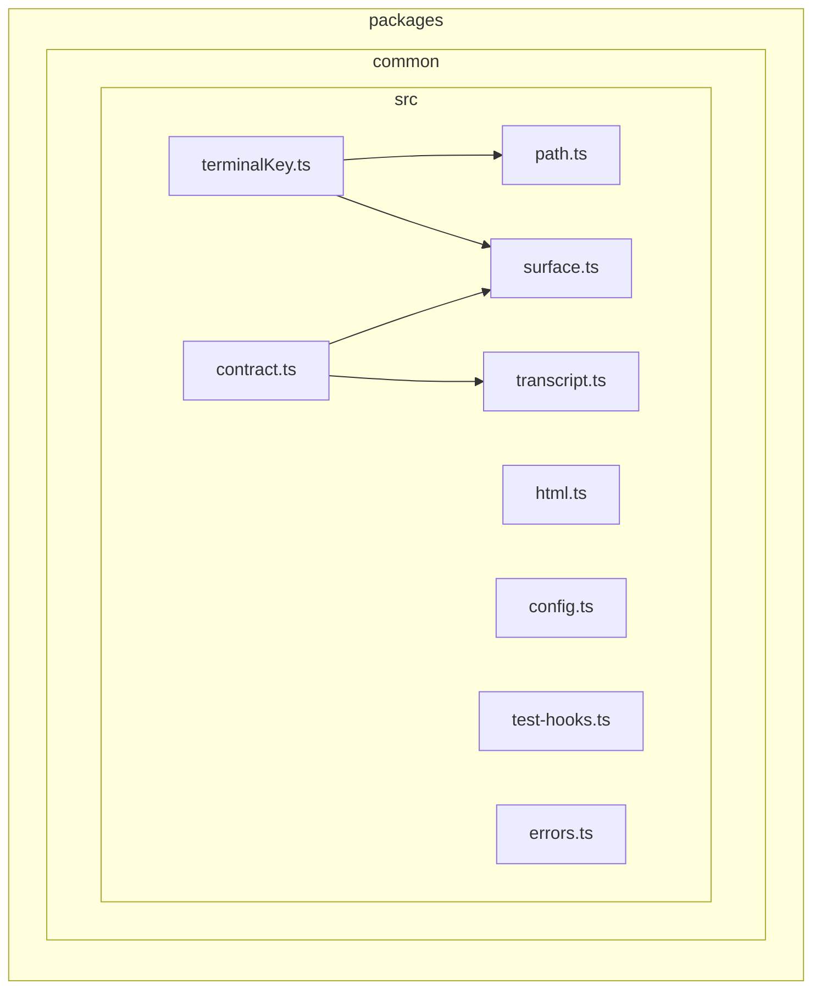

### `integrations/anyagent`

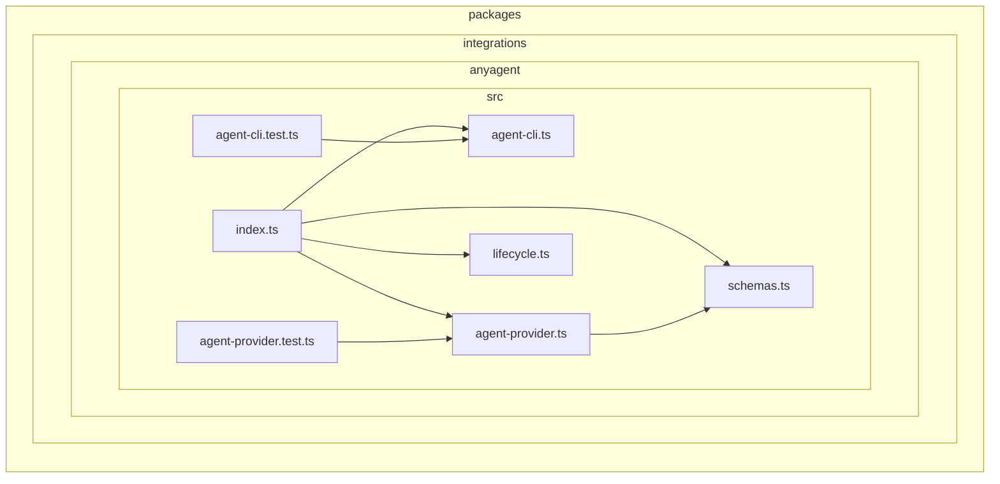

### `integrations/claude-code`

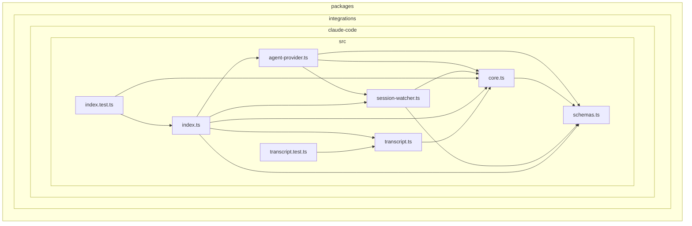

### `integrations/codex`

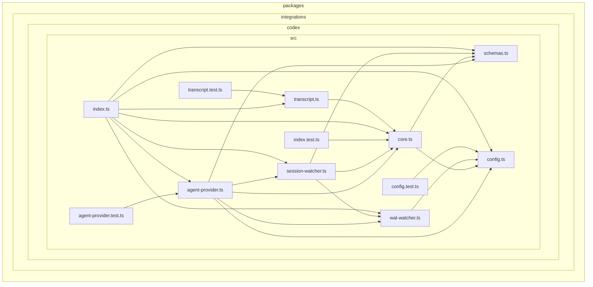

### `integrations/git`

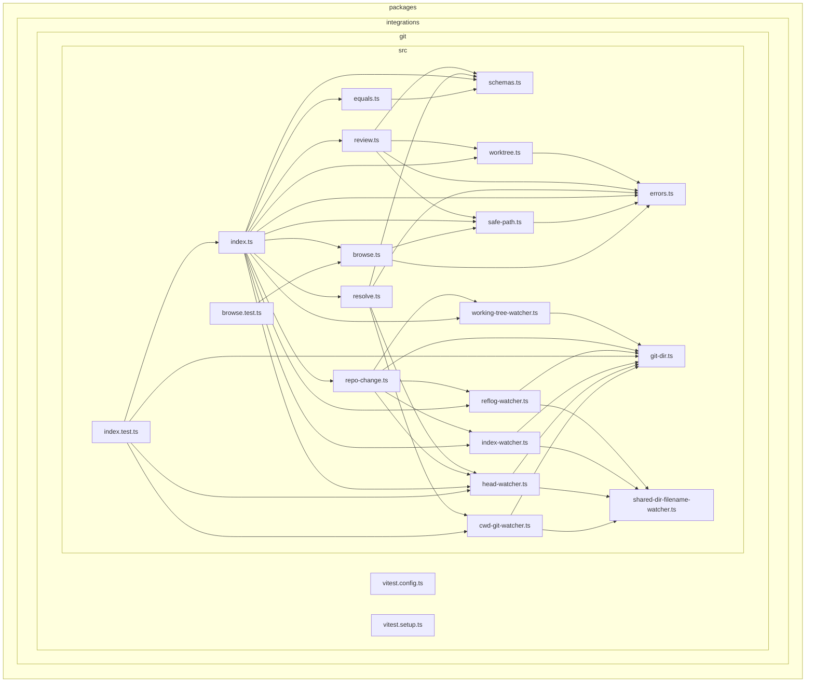

### `integrations/github`

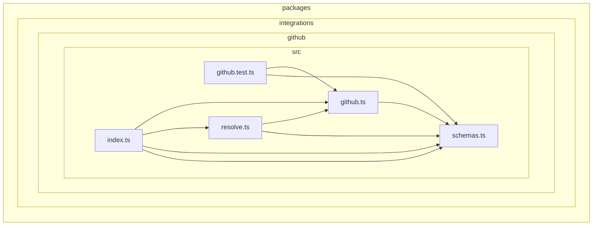

### `integrations/opencode`

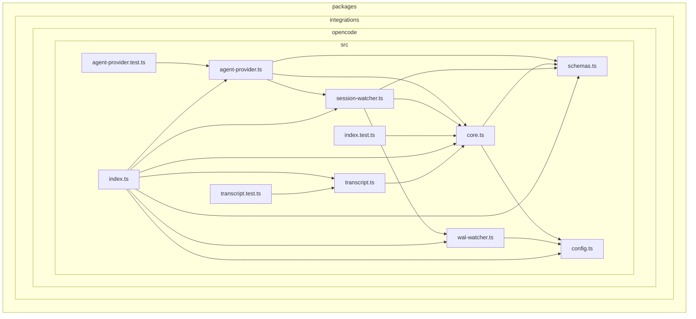

### `memorable-names`

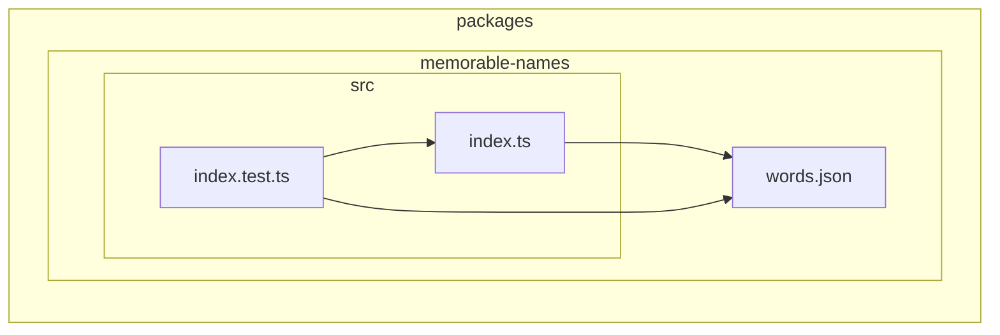

### `server`

```mermaid
flowchart LR

subgraph packages["packages"]
  subgraph packages_server["server"]
    subgraph packages_server_src["src"]
      packages_server_src_activity_ts["activity.ts"]
      packages_server_src_log_ts["log.ts"]
      packages_server_src_hostname_ts["hostname.ts"]
      packages_server_src_surface_ts["surface.ts"]
      packages_server_src_publisher_ts["publisher.ts"]
      packages_server_src_session_ts["session.ts"]
      packages_server_src_state_ts["state.ts"]
      packages_server_src_terminal_registry_ts["terminal-registry.ts"]
      packages_server_src_pty_ts["pty.ts"]
      packages_server_src_shell_ts["shell.ts"]
      packages_server_src_koluRoot_ts["koluRoot.ts"]
      packages_server_src_cacheControl_ts["cacheControl.ts"]
      packages_server_src_clipboard_ts["clipboard.ts"]
      packages_server_src_diagnostics_ts["diagnostics.ts"]
      packages_server_src_terminals_ts["terminals.ts"]
      subgraph packages_server_src_meta["meta"]
        packages_server_src_meta_index_ts["index.ts"]
        packages_server_src_meta_agent_command_ts["agent-command.ts"]
        packages_server_src_meta_state_ts["state.ts"]
        packages_server_src_meta_agent_ts["agent.ts"]
        packages_server_src_meta_git_ts["git.ts"]
        packages_server_src_meta_github_ts["github.ts"]
        packages_server_src_meta_process_ts["process.ts"]
        packages_server_src_meta_agent_test_ts["agent.test.ts"]
        packages_server_src_meta_state_test_ts["state.test.ts"]
      end
      packages_server_src_index_ts["index.ts"]
      packages_server_src_pwaIdentity_ts["pwaIdentity.ts"]
      packages_server_src_router_ts["router.ts"]
      packages_server_src_tls_ts["tls.ts"]
      packages_server_src_pty_test_ts["pty.test.ts"]
      packages_server_src_pwaIdentity_test_ts["pwaIdentity.test.ts"]
      packages_server_src_session_test_ts["session.test.ts"]
      packages_server_src_shell_test_ts["shell.test.ts"]
      packages_server_src_state_test_ts["state.test.ts"]
    end
    packages_server_package_json["package.json"]
  end
end
packages_server_src_activity_ts-->packages_server_src_log_ts
packages_server_src_activity_ts-->packages_server_src_surface_ts
packages_server_src_log_ts-->packages_server_src_hostname_ts
packages_server_src_surface_ts-->packages_server_src_log_ts
packages_server_src_surface_ts-->packages_server_src_publisher_ts
packages_server_src_surface_ts-->packages_server_src_session_ts
packages_server_src_surface_ts-->packages_server_src_state_ts
packages_server_src_surface_ts-->packages_server_src_terminal_registry_ts
packages_server_src_session_ts-->packages_server_src_log_ts
packages_server_src_session_ts-->packages_server_src_publisher_ts
packages_server_src_session_ts-->packages_server_src_state_ts
packages_server_src_session_ts-->packages_server_src_surface_ts
packages_server_src_state_ts-->packages_server_src_log_ts
packages_server_src_terminal_registry_ts-->packages_server_src_pty_ts
packages_server_src_pty_ts-->packages_server_src_log_ts
packages_server_src_pty_ts-->packages_server_src_shell_ts
packages_server_src_shell_ts-->packages_server_src_koluRoot_ts
packages_server_src_koluRoot_ts-->packages_server_src_hostname_ts
packages_server_src_clipboard_ts-->packages_server_src_koluRoot_ts
packages_server_src_diagnostics_ts-->packages_server_src_log_ts
packages_server_src_diagnostics_ts-->packages_server_src_publisher_ts
packages_server_src_diagnostics_ts-->packages_server_src_terminals_ts
packages_server_src_terminals_ts-->packages_server_src_clipboard_ts
packages_server_src_terminals_ts-->packages_server_src_log_ts
packages_server_src_terminals_ts-->packages_server_src_meta_index_ts
packages_server_src_terminals_ts-->packages_server_src_pty_ts
packages_server_src_terminals_ts-->packages_server_src_publisher_ts
packages_server_src_terminals_ts-->packages_server_src_surface_ts
packages_server_src_terminals_ts-->packages_server_src_terminal_registry_ts
packages_server_src_meta_index_ts-->packages_server_src_terminal_registry_ts
packages_server_src_meta_index_ts-->packages_server_src_meta_agent_command_ts
packages_server_src_meta_index_ts-->packages_server_src_meta_agent_ts
packages_server_src_meta_index_ts-->packages_server_src_meta_git_ts
packages_server_src_meta_index_ts-->packages_server_src_meta_github_ts
packages_server_src_meta_index_ts-->packages_server_src_meta_process_ts
packages_server_src_meta_index_ts-->packages_server_src_meta_state_ts
packages_server_src_meta_agent_command_ts-->packages_server_src_activity_ts
packages_server_src_meta_agent_command_ts-->packages_server_src_log_ts
packages_server_src_meta_agent_command_ts-->packages_server_src_publisher_ts
packages_server_src_meta_agent_command_ts-->packages_server_src_terminal_registry_ts
packages_server_src_meta_agent_command_ts-->packages_server_src_meta_state_ts
packages_server_src_meta_state_ts-->packages_server_src_log_ts
packages_server_src_meta_state_ts-->packages_server_src_publisher_ts
packages_server_src_meta_state_ts-->packages_server_src_surface_ts
packages_server_src_meta_state_ts-->packages_server_src_terminal_registry_ts
packages_server_src_meta_agent_ts-->packages_server_src_log_ts
packages_server_src_meta_agent_ts-->packages_server_src_publisher_ts
packages_server_src_meta_agent_ts-->packages_server_src_terminal_registry_ts
packages_server_src_meta_agent_ts-->packages_server_src_meta_agent_command_ts
packages_server_src_meta_agent_ts-->packages_server_src_meta_state_ts
packages_server_src_meta_git_ts-->packages_server_src_activity_ts
packages_server_src_meta_git_ts-->packages_server_src_log_ts
packages_server_src_meta_git_ts-->packages_server_src_publisher_ts
packages_server_src_meta_git_ts-->packages_server_src_terminal_registry_ts
packages_server_src_meta_git_ts-->packages_server_src_meta_state_ts
packages_server_src_meta_github_ts-->packages_server_src_log_ts
packages_server_src_meta_github_ts-->packages_server_src_publisher_ts
packages_server_src_meta_github_ts-->packages_server_src_terminal_registry_ts
packages_server_src_meta_github_ts-->packages_server_src_meta_state_ts
packages_server_src_meta_process_ts-->packages_server_src_log_ts
packages_server_src_meta_process_ts-->packages_server_src_publisher_ts
packages_server_src_meta_process_ts-->packages_server_src_terminal_registry_ts
packages_server_src_meta_process_ts-->packages_server_src_meta_state_ts
packages_server_src_index_ts-->packages_server_package_json
packages_server_src_index_ts-->packages_server_src_cacheControl_ts
packages_server_src_index_ts-->packages_server_src_diagnostics_ts
packages_server_src_index_ts-->packages_server_src_hostname_ts
packages_server_src_index_ts-->packages_server_src_koluRoot_ts
packages_server_src_index_ts-->packages_server_src_log_ts
packages_server_src_index_ts-->packages_server_src_pwaIdentity_ts
packages_server_src_index_ts-->packages_server_src_router_ts
packages_server_src_index_ts-->packages_server_src_session_ts
packages_server_src_index_ts-->packages_server_src_shell_ts
packages_server_src_index_ts-->packages_server_src_terminals_ts
packages_server_src_index_ts-->packages_server_src_tls_ts
packages_server_src_router_ts-->packages_server_src_clipboard_ts
packages_server_src_router_ts-->packages_server_src_hostname_ts
packages_server_src_router_ts-->packages_server_src_log_ts
packages_server_src_router_ts-->packages_server_src_publisher_ts
packages_server_src_router_ts-->packages_server_src_pwaIdentity_ts
packages_server_src_router_ts-->packages_server_src_surface_ts
packages_server_src_router_ts-->packages_server_src_terminal_registry_ts
packages_server_src_router_ts-->packages_server_src_terminals_ts
packages_server_src_tls_ts-->packages_server_src_log_ts
packages_server_src_meta_agent_test_ts-->packages_server_src_meta_agent_ts
packages_server_src_meta_state_test_ts-->packages_server_src_publisher_ts
packages_server_src_meta_state_test_ts-->packages_server_src_terminal_registry_ts
packages_server_src_meta_state_test_ts-->packages_server_src_meta_state_ts
packages_server_src_pty_test_ts-->packages_server_src_pty_ts
packages_server_src_pwaIdentity_test_ts-->packages_server_src_pwaIdentity_ts
packages_server_src_session_test_ts-->packages_server_src_session_ts
packages_server_src_shell_test_ts-->packages_server_src_shell_ts
packages_server_src_state_test_ts-->packages_server_src_state_ts
```

### `shared`

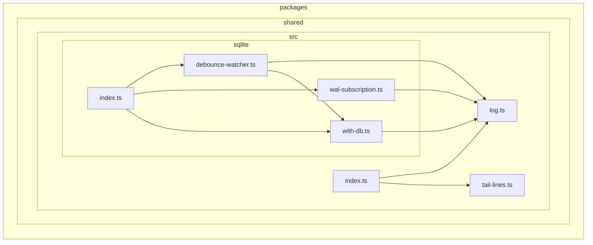

### `solid-pierre`

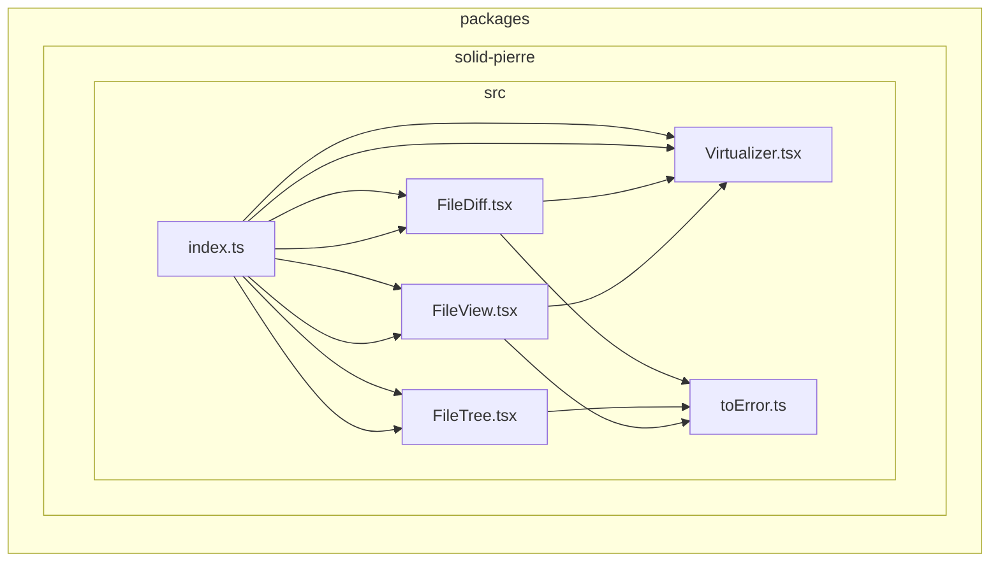

### `surface`

```mermaid
flowchart LR

subgraph packages["packages"]
  subgraph packages_surface["surface"]
    subgraph packages_surface_src["src"]
      packages_surface_src_define_ts["define.ts"]
      packages_surface_src_index_ts["index.ts"]
      subgraph packages_surface_src_solid["solid"]
        packages_surface_src_solid_index_ts["index.ts"]
        packages_surface_src_solid_createReactiveSubscription_ts["createReactiveSubscription.ts"]
        packages_surface_src_solid_createSubscription_ts["createSubscription.ts"]
        packages_surface_src_solid_writeValue_ts["writeValue.ts"]
        packages_surface_src_solid_surfaceClient_ts["surfaceClient.ts"]
        packages_surface_src_solid_useCell_ts["useCell.ts"]
        packages_surface_src_solid_useCollection_ts["useCollection.ts"]
        packages_surface_src_solid_useEvent_ts["useEvent.ts"]
        packages_surface_src_solid_useStream_ts["useStream.ts"]
        packages_surface_src_solid_createReactiveSubscription_test_ts["createReactiveSubscription.test.ts"]
        packages_surface_src_solid_createSubscription_test_ts["createSubscription.test.ts"]
      end
      packages_surface_src_client_ts["client.ts"]
      packages_surface_src_server_ts["server.ts"]
      packages_surface_src_cellHandlers_test_ts["cellHandlers.test.ts"]
    end
    subgraph packages_surface_example["example"]
      subgraph packages_surface_example_src["src"]
        subgraph packages_surface_example_src_client["client"]
          packages_surface_example_src_client_App_tsx["App.tsx"]
          packages_surface_example_src_client_wire_ts["wire.ts"]
          packages_surface_example_src_client_main_tsx["main.tsx"]
          packages_surface_example_src_client_styles_css["styles.css"]
        end
        subgraph packages_surface_example_src_common["common"]
          packages_surface_example_src_common_surface_ts["surface.ts"]
        end
        subgraph packages_surface_example_src_server["server"]
          packages_surface_example_src_server_main_ts["main.ts"]
          packages_surface_example_src_server_router_ts["router.ts"]
          packages_surface_example_src_server_store_ts["store.ts"]
        end
      end
      packages_surface_example_vite_config_ts["vite.config.ts"]
    end
    packages_surface_vitest_config_ts["vitest.config.ts"]
  end
end
packages_surface_src_define_ts-->packages_surface_src_index_ts
packages_surface_src_define_ts-->packages_surface_src_index_ts
packages_surface_src_solid_index_ts-->packages_surface_src_client_ts
packages_surface_src_solid_index_ts-->packages_surface_src_solid_createReactiveSubscription_ts
packages_surface_src_solid_index_ts-->packages_surface_src_solid_createSubscription_ts
packages_surface_src_solid_index_ts-->packages_surface_src_solid_surfaceClient_ts
packages_surface_src_solid_index_ts-->packages_surface_src_solid_useCell_ts
packages_surface_src_solid_index_ts-->packages_surface_src_solid_useCollection_ts
packages_surface_src_solid_index_ts-->packages_surface_src_solid_useEvent_ts
packages_surface_src_solid_index_ts-->packages_surface_src_solid_useStream_ts
packages_surface_src_solid_createReactiveSubscription_ts-->packages_surface_src_solid_createSubscription_ts
packages_surface_src_solid_createReactiveSubscription_ts-->packages_surface_src_solid_writeValue_ts
packages_surface_src_solid_createSubscription_ts-->packages_surface_src_solid_writeValue_ts
packages_surface_src_solid_surfaceClient_ts-->packages_surface_src_client_ts
packages_surface_src_solid_surfaceClient_ts-->packages_surface_src_define_ts
packages_surface_src_solid_surfaceClient_ts-->packages_surface_src_solid_createReactiveSubscription_ts
packages_surface_src_solid_surfaceClient_ts-->packages_surface_src_solid_createSubscription_ts
packages_surface_src_solid_surfaceClient_ts-->packages_surface_src_solid_useCell_ts
packages_surface_src_solid_surfaceClient_ts-->packages_surface_src_solid_useCollection_ts
packages_surface_src_solid_surfaceClient_ts-->packages_surface_src_solid_useEvent_ts
packages_surface_src_solid_surfaceClient_ts-->packages_surface_src_solid_useStream_ts
packages_surface_src_solid_useCell_ts-->packages_surface_src_client_ts
packages_surface_src_solid_useCell_ts-->packages_surface_src_index_ts
packages_surface_src_solid_useCell_ts-->packages_surface_src_solid_createSubscription_ts
packages_surface_src_solid_useCollection_ts-->packages_surface_src_client_ts
packages_surface_src_solid_useCollection_ts-->packages_surface_src_index_ts
packages_surface_src_solid_useCollection_ts-->packages_surface_src_solid_createSubscription_ts
packages_surface_src_solid_useEvent_ts-->packages_surface_src_client_ts
packages_surface_src_solid_useEvent_ts-->packages_surface_src_index_ts
packages_surface_src_solid_useStream_ts-->packages_surface_src_client_ts
packages_surface_src_solid_useStream_ts-->packages_surface_src_index_ts
packages_surface_src_solid_useStream_ts-->packages_surface_src_solid_createReactiveSubscription_ts
packages_surface_src_solid_useStream_ts-->packages_surface_src_solid_createSubscription_ts
packages_surface_src_server_ts-->packages_surface_src_define_ts
packages_surface_src_server_ts-->packages_surface_src_index_ts
packages_surface_example_src_client_App_tsx-->packages_surface_example_src_common_surface_ts
packages_surface_example_src_client_App_tsx-->packages_surface_example_src_client_wire_ts
packages_surface_example_src_common_surface_ts-->packages_surface_src_define_ts
packages_surface_example_src_client_wire_ts-->packages_surface_example_src_common_surface_ts
packages_surface_example_src_client_wire_ts-->packages_surface_src_solid_index_ts
packages_surface_example_src_client_main_tsx-->packages_surface_example_src_client_App_tsx
packages_surface_example_src_client_main_tsx-->packages_surface_example_src_client_styles_css
packages_surface_example_src_server_main_ts-->packages_surface_example_src_server_router_ts
packages_surface_example_src_server_router_ts-->packages_surface_example_src_common_surface_ts
packages_surface_example_src_server_router_ts-->packages_surface_example_src_server_store_ts
packages_surface_example_src_server_router_ts-->packages_surface_src_server_ts
packages_surface_example_src_server_store_ts-->packages_surface_example_src_common_surface_ts
packages_surface_example_src_server_store_ts-->packages_surface_src_server_ts
packages_surface_src_cellHandlers_test_ts-->packages_surface_src_define_ts
packages_surface_src_cellHandlers_test_ts-->packages_surface_src_index_ts
packages_surface_src_cellHandlers_test_ts-->packages_surface_src_server_ts
packages_surface_src_solid_createReactiveSubscription_test_ts-->packages_surface_src_solid_createReactiveSubscription_ts
packages_surface_src_solid_createReactiveSubscription_test_ts-->packages_surface_src_solid_createSubscription_ts
packages_surface_src_solid_createSubscription_test_ts-->packages_surface_src_solid_createSubscription_ts
```

### `terminal-themes`

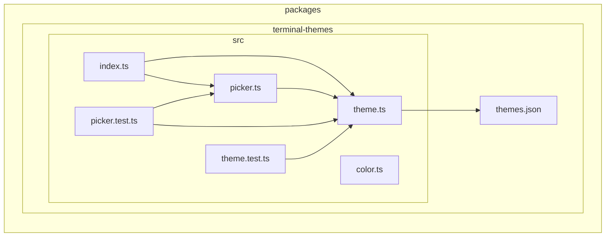

### `transcript-core`

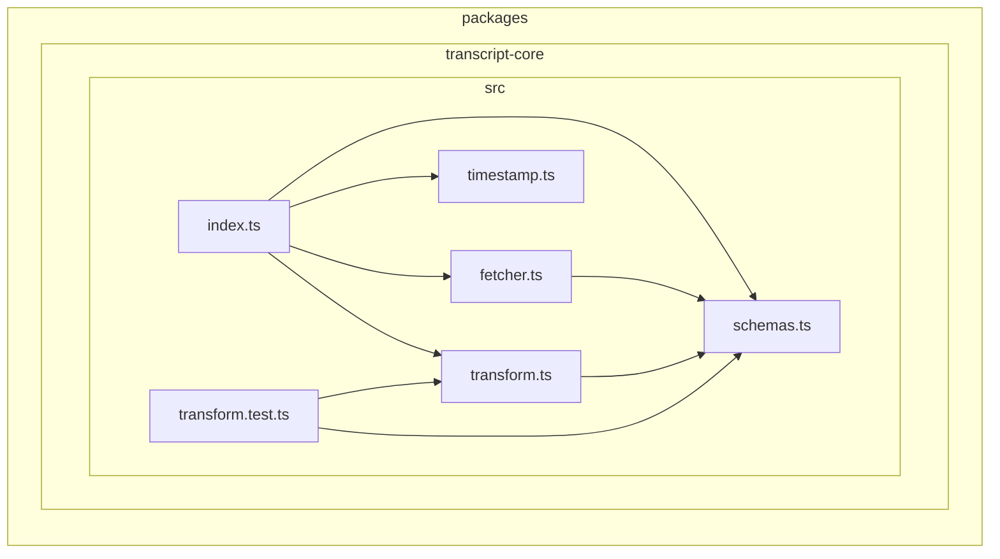

### `transcript-html`

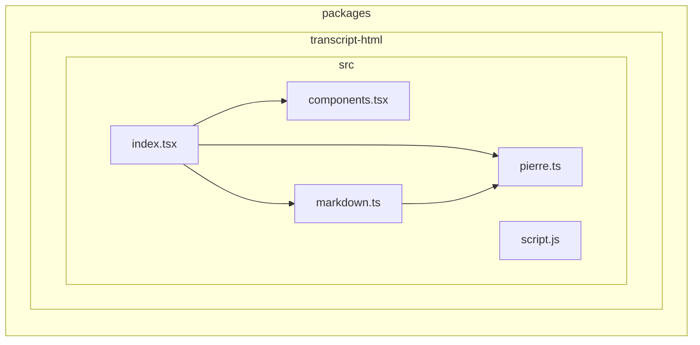
