<!-- Generated by `just depcruise-graph`. Do not edit by hand. -->

# Dependency graph

Generated by [`dependency-cruiser`](https://github.com/sverweij/dependency-cruiser); regenerate with `just depcruise-graph`.

## Package overview

One node per workspace package, edges between them. Mirrors the architecture table in the top-level README.

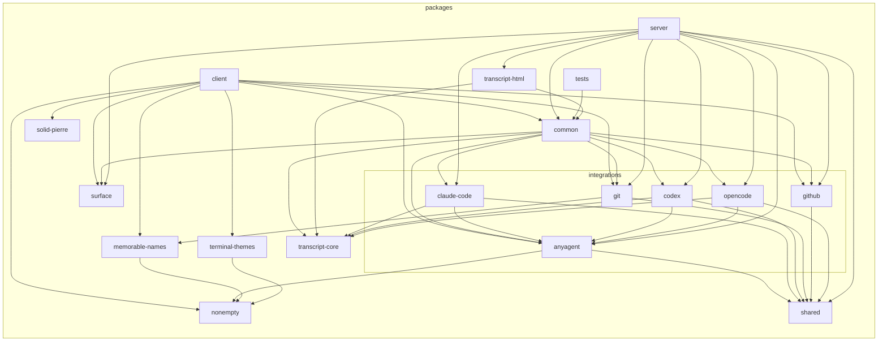

## Module-level detail

Each section below clusters the internal files of one workspace package by subfolder — `canvas/`, `dock/`, `input/`, etc. each become a single node, with edges aggregated. Top-level files (e.g. `App.tsx`) stay as themselves. Cross-package edges are excluded — those live in the overview above. Packages with no internal edges are omitted.

### `client`

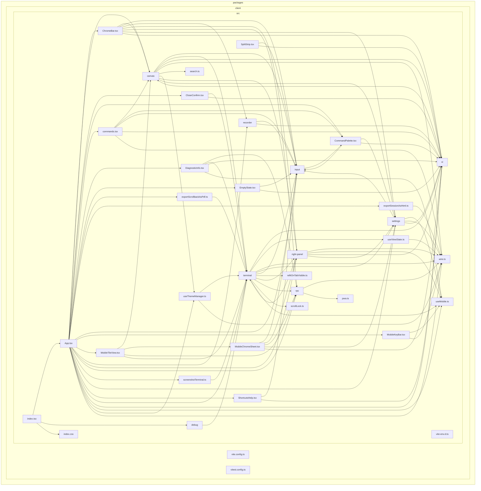

### `common`

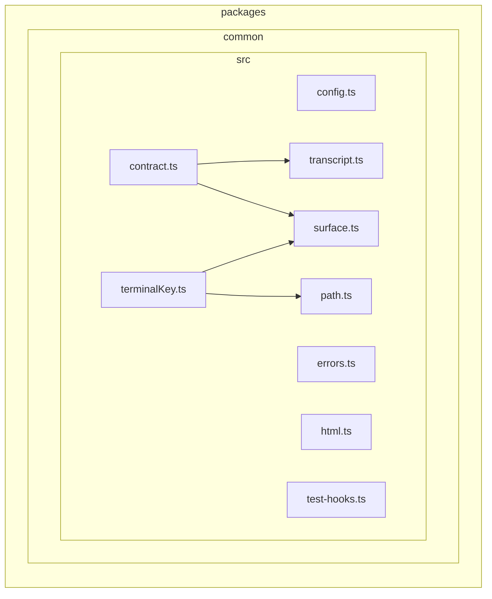

### `integrations/anyagent`

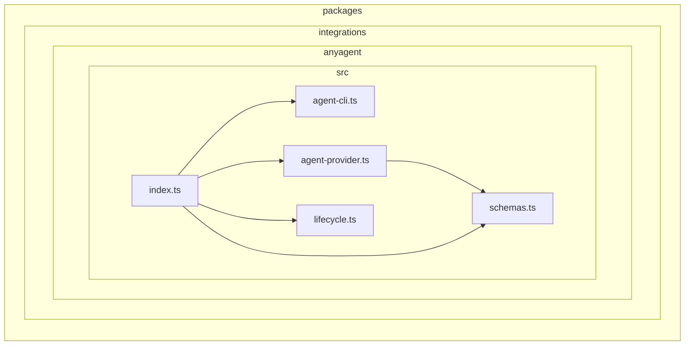

### `integrations/claude-code`

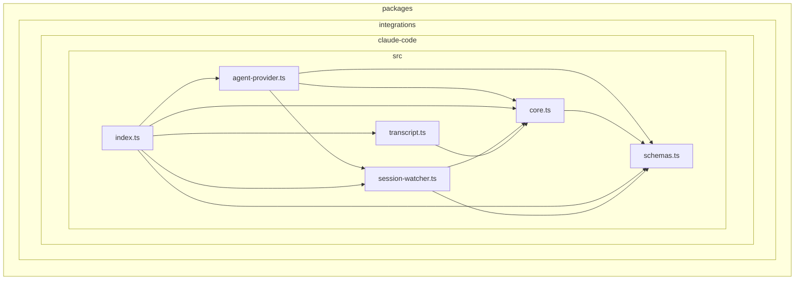

### `integrations/codex`

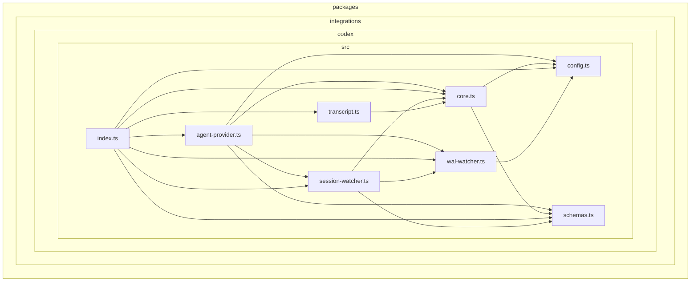

### `integrations/git`

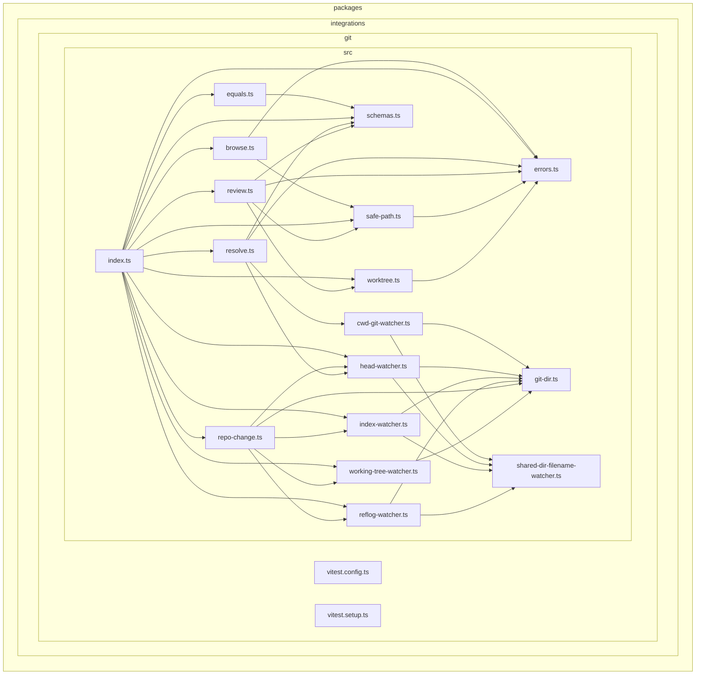

### `integrations/github`

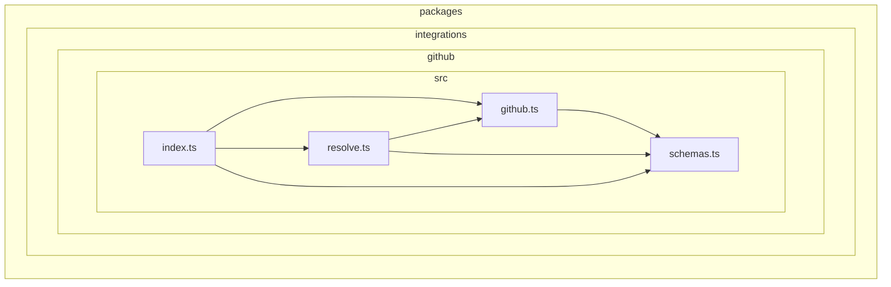

### `integrations/opencode`

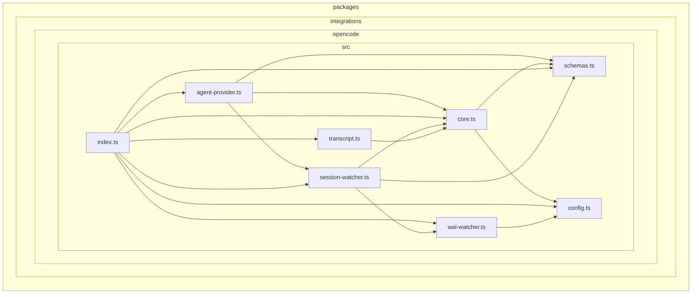

### `memorable-names`

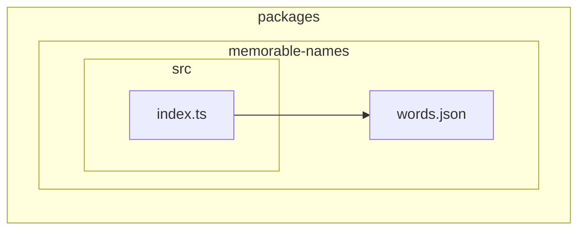

### `server`

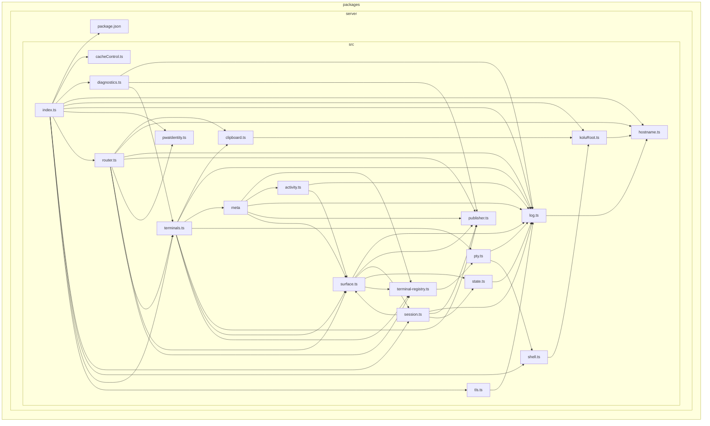

### `shared`

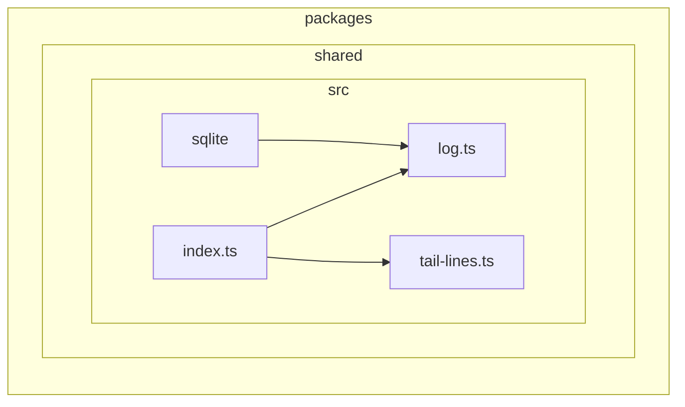

### `solid-pierre`

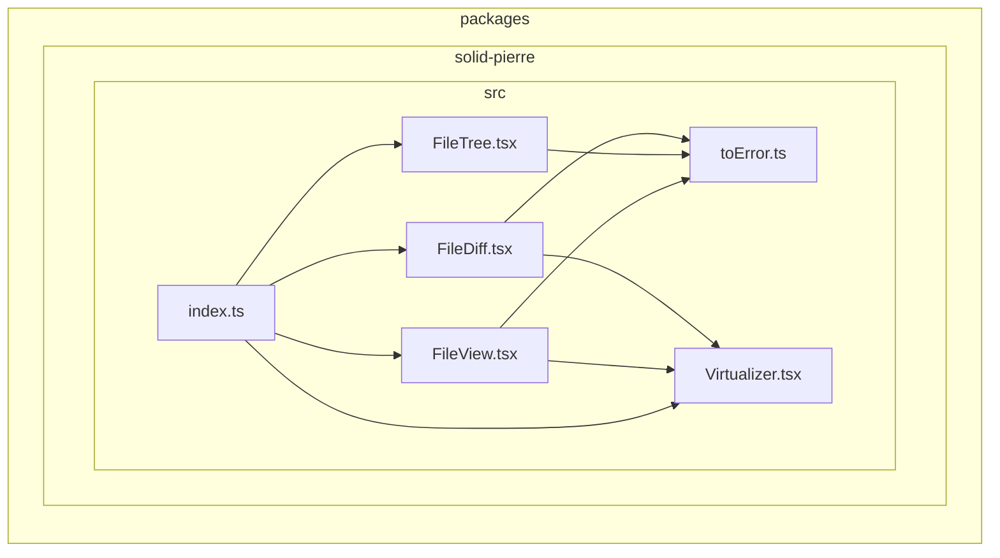

### `surface`

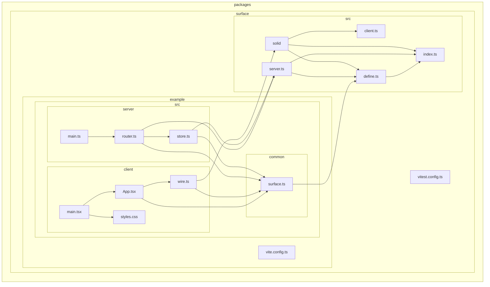

### `terminal-themes`

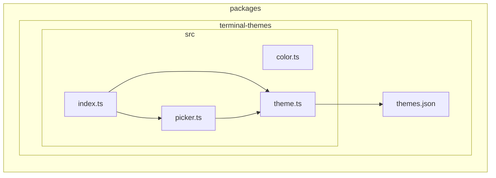

### `transcript-core`

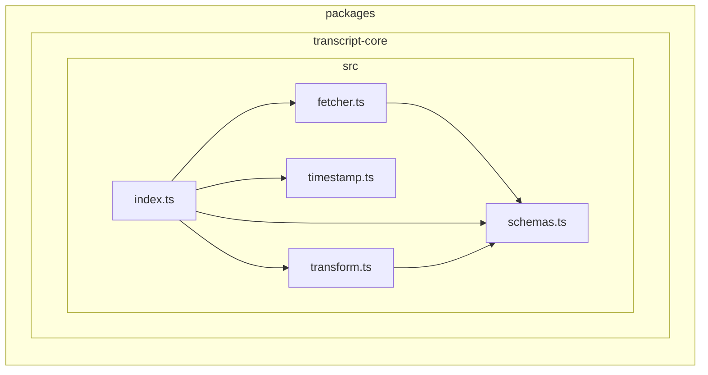

### `transcript-html`

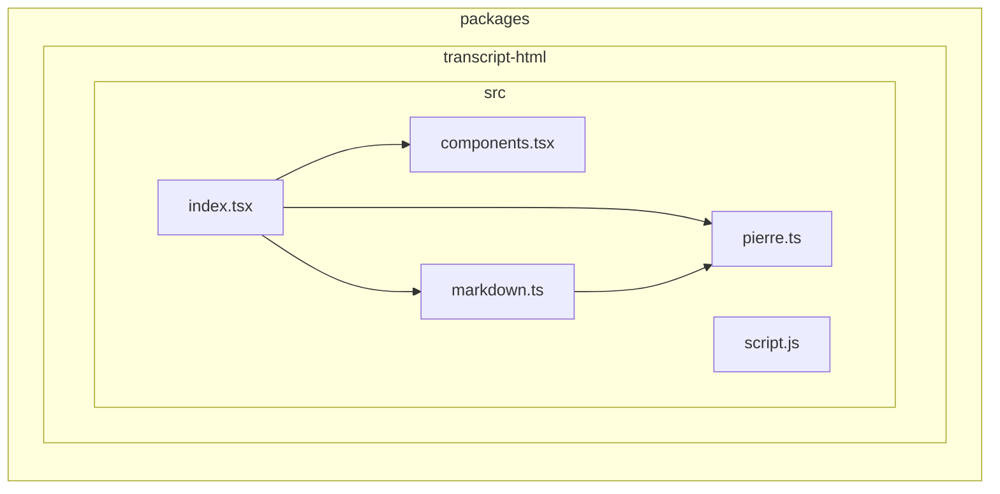
