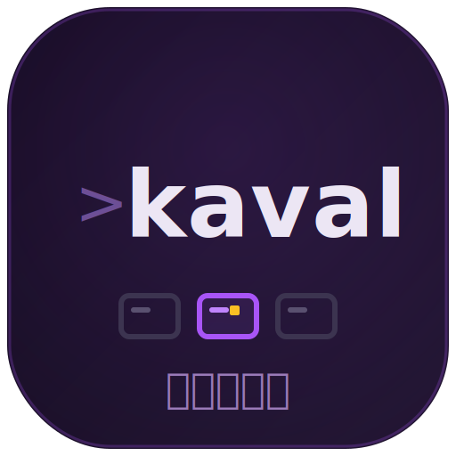

# kaval



**kaval** (Tamil காவல், _kāval_ — "watch, guard"; pronounced **_KAH_-val**, the
first _a_ long, as in _father_) is the **multi-client PTY-owner primitive** (and
the standalone `kaval` daemon built on it). One `PtyHost` owns any number of
PTYs; each PTY is a `node-pty` child paired with an `@xterm/headless` screen
mirror and a set of VT-derived event taps, fanned out to any number of
consumers through a bounded broadcast `Channel`.

It owns **only** the PTY. It knows nothing about git, pull requests, agent
detection, the file tree, or any wire protocol — those live above it. It also
knows nothing about shell-environment preparation: callers hand it a ready
`shell` / `args` / `env` (kolu builds those in [`kolu-pty`](../integrations/pty)).

```
                       ┌──────────────────────── PtyHost ───────────────────────┐
   spawn(shell,env) ──►│  node-pty child ──► @xterm/headless mirror              │
                       │        │                     │                          │
                       │     onData              OSC 7 / 0,2 / 633               │
                       │        ▼                     ▼                          │
                       │   data Channel    cwd / title / commandRun Channels     │
                       └──────────┬───────────────────┬─────────────────────────┘
                        attach()  │      subscribe*()  │   exitPromise / foregroundPid
                                  ▼                    ▼
                          late-join clients     metadata consumers
```

## What it taps

| Tap            | Source                          | API                       |
| -------------- | ------------------------------- | ------------------------- |
| screen output  | `node-pty` `onData`             | `attach` (snapshot+deltas)|
| cwd            | OSC 7 `file://` reports         | `subscribeCwd` / `getCwd` |
| title          | OSC 0/2 title changes           | `subscribeTitle` / `getTitle` |
| command-run    | OSC 633 ; E ; `<cmd>` preexec   | `subscribeCommandRun` / `getLastCommand` |
| exit           | child exit code                 | `exitPromise`             |
| foreground pid | `tcgetpgrp(3)` at the tty       | `getForegroundPid`        |

## Two load-bearing properties

**Race-free attach.** `attach()` calls `subscribe()` then `serialize()` as two
back-to-back *synchronous* statements. Because the PTY publishes data only from
the headless write *callback* (a later task, after the byte is parsed into the
mirror), nothing can interleave between the two — every byte lands in exactly
one of `snapshot` / `deltas`, with no gap and no overlap. This is what lets a
late-joining client reconstruct the screen and then stream live output without
losing or double-painting a single chunk.

**Cheap under a reconnect storm.** A client that drops and reconnects
re-`attach()`es every terminal at once, aborting the in-flight attaches and
re-issuing them. Two defenses keep that burst from serializing the mirror N times
over: an attach whose `signal` is already aborted returns an empty snapshot and
does **no** `serialize()` (its subscriber is already gone), and the serialized
snapshot is **memoized per publish-epoch** — a burst of attaches to one PTY
between two output bytes shares a single `serialize()`, the memo cleared the
instant new data parses into the mirror.

**Drop-slow-subscriber.** Each subscriber buffers independently up to
`maxQueue` (default 10,000) items. A consumer that stops draining — a wedged
browser tab on the chatty `data` stream — is **dropped** (its iterator ends)
rather than pinning server memory without bound. The client's transparent
re-subscribe then delivers a fresh snapshot.

## Usage

```ts
import { createPtyHost } from "kaval";

const host = createPtyHost({ log });

const { id, pid } = host.spawn({
  shell: "/bin/bash",
  args: ["--rcfile", wrapperRcPath],
  env, // fully prepared by the caller
  cwd: "/home/me/project",
  scrollback: 10_000,
  onDispose: () => cleanupRcFiles(),
});

// Late-join client: snapshot first, then live deltas.
const { snapshot, deltas } = host.attach(id, signal);
if (snapshot) send(snapshot);
for await (const chunk of deltas) send(chunk);

// Metadata taps.
for await (const cwd of host.subscribeCwd(id, signal)) onCwd(cwd);

host.write(id, "ls\n");
host.resize(id, 120, 40);
host.kill(id); // exitPromise(id) still resolves
```

## Scope

This package began as a pure primitive extracted from kolu's in-process PTY
code (`#951` R-4, slice R4a), consumed **in-process** by `kolu-server`. It now
also ships the standalone `kaval` daemon: the same `PtyHost` served over a unix
socket via `@kolu/surface-daemon`'s `gate → serve → teardown` skeleton, reached
by the `kaval-tui` CLI. The primitive itself stays pure — it knows nothing about
the socket, the gate, or the wire; those compose on top.
