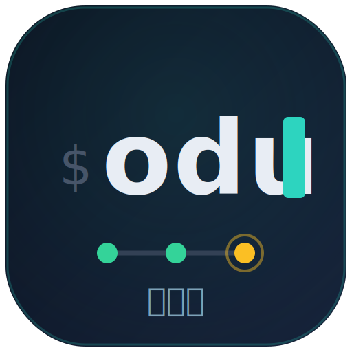

# odu



**A CI runner you attach to.** odu (Tamil ஓடு — *run*) runs your
[`just`](https://just.systems) recipe DAG across machines, posts GitHub
commit statuses, and — unlike every batch CI tool — holds the run as **live,
typed state you can attach to** from a terminal dashboard while it runs.

```
$ odu run                      # the whole DAG, every configured platform
$ odu monitor                  # attach a live dashboard to the run (other terminal)
$ odu logs -f e2e@x86_64-linux # follow one node's output
```

## Why

Local CI tools translate your task graph into a batch process, run it, and
leave you log files. Want to know what's happening mid-run? You scrape logs
or poll a process supervisor's socket with a separately-versioned client.

odu inverts that. The runner *owns* the pipeline as state and serves it as
three typed primitives over plain ssh (an [oRPC](https://orpc.io) contract,
base64-framed over stdio — no daemons, no ports, no agents to install):

| Primitive | Call | What it carries |
| --- | --- | --- |
| **Cell** | `surface.nodes.get({})` | The whole pipeline's state — one snapshot, then deltas as nodes change. |
| **Stream** | `surface.nodeLog.get({ id })` | One node's output — a buffered snapshot first (late subscribers replay from the top), then appends. |
| **Procedure** | `surface.node.rerun({ id })` | The *only* mutation: reset a node + its transitive dependents and reschedule. |

Every face is a thin adapter over the same contract: the bundled terminal
dashboard today; a web dashboard and an MCP server for coding agents are
designed on the same surface (see the roadmap below).

## How a run works

```
odu run  (coordinator, your machine)
 ├─ strict gate: refuse a dirty tree, pin HEAD via `git worktree`
 ├─ ingest: `just --dump` → the [metadata("ci")] recipe's dependency DAG
 ├─ per platform lane (hosts.json):
 │    nix copy the runner derivation → realise on the host →
 │    ssh host odu-runner --stdio → configure over the surface →
 │    the host fetches your pushed SHA into a writable per-SHA workspace
 │    and runs each node as `just --no-deps <recipe>`
 ├─ fan-in: lane states merge into one surface, served on .ci/odu.sock
 │    (odu status / logs / monitor attach to it, live)
 ├─ logs: .ci/<sha>/<platform>/<recipe>.log — durable even if the runner dies
 └─ GitHub: commit status per <recipe>@<platform> context, posted on
    transitions read from the state cell (credentials never leave your machine)
```

A lane host needs **ssh + Nix + outbound https**. Nothing else: the runner
binary travels as a Nix closure, the toolchain comes from your repo's dev
shell, and the source arrives by `git fetch` of the pushed SHA.

## Install / run

odu currently lives in the [kolu](https://github.com/juspay/kolu) monorepo:

```sh
nix run github:juspay/kolu#odu -- run --no-strict     # from anywhere
nix run .#odu -- run                                  # inside the repo
```

### Configure platforms

`~/.config/odu/hosts.json` (or `$ODU_HOSTS`; falls back to justci's
`~/.config/justci/hosts.json` so migrating needs zero config):

```json
{
  "x86_64-linux": "my-linux-builder",
  "aarch64-darwin": "me@mac-mini.local"
}
```

Keys are Nix system tuples; values are anything ssh can dial, or
`localhost` (runs directly, skipping the closure copy). Missing platforms
drop from the fanout. `--host PLAT=ADDR` pins a platform for one run —
that is how kolu's warm-pool lease (`ci/pu/run.sh`) injects a leased box.

### Tag your DAG

Exactly one recipe carries `[metadata("ci")]`; its dependency closure is the
pipeline:

```just
[metadata("ci")]
default: build test lint
```

## CLI

```
odu run [recipe[@platform]…]      run (selectors compose; bare names fan out
                                  to every platform)
    --platform P (repeatable)     slice the fanout
    --host P=ADDR (repeatable)    one-shot host pin
    --root NAMEPATH               alternative DAG root
    --no-deps                     skip the dependency closure
    --no-post                     strict, but no GitHub writes
    --no-snapshot                 live tree, implies --no-post
    --no-strict                   ≡ --no-snapshot --no-post (dev iteration)
    --progress json               one NDJSON line per node transition
odu status [-o json]              snapshot a live run
odu logs [-f] <node>              replay (+ follow) one node's log
odu monitor [-o json]             live dashboard (tty) / transition stream
odu dump | graph                  resolved pipeline as JSON / Mermaid
odu protect [--dry-run]           sync branch protection's required contexts
```

**Strict by default**: a real CI run refuses a dirty tree, tests the pinned
HEAD commit, posts statuses. The opt-outs exist for dev iteration, not CI.

## Honest notes

- **Pushed SHAs only on remote lanes.** Hosts fetch your commit from the
  origin remote (anonymous https). odu does not ship git bundles, so a
  remote lane can't test an unpushed commit. Localhost lanes can.
- **Live-tree mode is localhost-only.** `--no-snapshot`/`--no-strict` run the
  live working tree, but only a localhost lane sees it — a remote lane still
  fetches the committed HEAD. So on a *dirty* tree odu refuses remote lanes in
  live mode rather than hand back a verdict that silently tested stale code;
  slice to local platforms with `--platform`, or commit+push for a remote run.
- **One-shot lanes.** If the ssh link to a lane dies mid-run, that lane's
  unfinished nodes are marked `errored` (GitHub state `error`) and the run
  fails — live state does not survive a runner restart in Phase 1; the
  per-SHA log files do.
- **One run per checkout.** `.ci/odu.sock` is the lock; a second `odu run`
  in the same checkout refuses to start.
- **Idle attach is not here yet.** `odu status` with no live run exits 1;
  a long-lived idle runner you can attach to is Phase-2 territory.

## Lineage and roadmap

odu grew out of kolu's `mini-ci` example and replaced
[justci](https://github.com/juspay/justci) as the kolu repo's own CI — same
status contexts (`ci::e2e@x86_64-linux`), same per-SHA log layout, same
strict-mode flag table, so the migration is invisible to branch protection.
The design history, the justci comparison, and the phased roadmap (web +
MCP faces, then graduation to a standalone repo) live in the kolu Atlas:
[*A CI runner you attach to*](https://github.com/juspay/kolu/blob/master/docs/atlas/dist/mini-ci-vs-justci.html).

License: AGPL-3.0-or-later.
